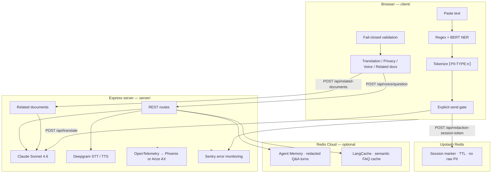

# Passage — Project Architecture & File Reference

**Passage** is a UC Berkeley AI Hackathon 2026 (World Track) demo: paste U.S. immigration correspondence, detect and redact PII entirely in the browser, translate and explain it via Claude in 10 languages, then ask follow-up questions by voice — with a hard privacy boundary so raw identifiers never reach external APIs.

This document describes the system architecture, every source file in the repository, what each file depends on, and an honest assessment of what is technically strong versus what is conventional or hackathon-scoped.

---

## Table of contents

1. [High-level architecture](#high-level-architecture)
2. [Technology stack](#technology-stack)
3. [Privacy and data flow](#privacy-and-data-flow)
4. [Application workflow](#application-workflow)
5. [UI localization (i18n)](#ui-localization-i18n)
6. [API surface](#api-surface)
7. [Complete file reference](#complete-file-reference)
8. [Technical assessment](#technical-assessment)
9. [Known limitations and duplication](#known-limitations-and-duplication)

---

## High-level architecture

Passage is a **monorepo** with three runnable surfaces:

| Surface | Role |
|---------|------|
| **Client** (`client/`) | React 19 + Vite SPA — detection, redaction, UI, voice capture |
| **Server** (`server/`) | Express API — Claude, Deepgram, Redis, observability |
| **Launcher** (`launch.mjs`, `Launch Passage.app`) | Orchestrates Docker Phoenix, both dev servers, browser lifecycle |



**The architectural bet:** redaction is not a feature flag — it is a **boundary**. Nothing network-bound carries raw A-numbers, SSNs, DOB, passport numbers, names, or addresses. Tokens are preserved through Claude; the UI deliberately does **not** reinsert raw values after translation (tokenized display only).

---

## Technology stack

| Layer | Choices |
|-------|---------|
| **Client runtime** | React 19, TypeScript, Vite 6 |
| **UI localization** | `client/src/i18n/` — 11 locale packs; `langCode` drives UI + translation target |
| **In-browser ML** | `@huggingface/transformers` — `Xenova/bert-base-NER` (Transformers.js) |
| **Voice** | `@deepgram/sdk` — Nova-3 STT, Aura-2 TTS (client token or server proxy) |
| **Server** | Express 4, TypeScript, `tsx` for dev |
| **LLM** | Anthropic SDK — `claude-sonnet-4-6` |
| **Session store** | Upstash Redis REST (`@upstash/redis`) — PII-free session markers |
| **Optional memory/cache** | Redis Cloud Agent Memory + LangCache (REST clients) |
| **Observability** | OpenTelemetry + OpenInference; Phoenix (local Docker) or Arize AX Cloud |
| **Errors** | Sentry (browser + Node), with shared PII scrubbing regex |
| **Verification** | Node/tsx scripts + Playwright E2E privacy audits |

---

## Privacy and data flow

| Stage | Where | Raw PII? | Notes |
|-------|-------|----------|-------|
| Paste | Browser only | Yes | Never sent until user clicks send |
| Detection | Browser | Yes | Regex + optional on-device NER; no network |
| Redaction | Browser | Replaced with tokens | `PII:TYPE:n` format |
| Pre-send leakage scan | Browser | Block if leak found | Sentry alert; translate blocked |
| Session registration | Upstash via scoped creds | No | Marker only; minted by server |
| Translate payload | Server → Claude | Tokens only | Server also validates token shape |
| Post-Claude validation | Browser | Fail-closed | Token check + raw-leak scan before render |
| Voice STT | Deepgram | User speech | Transcript redacted in browser before Claude |
| Voice answer | Browser | Tokens only | TTS uses explanation section, also tokenized |
| Agent Memory / LangCache | Redis Cloud | Redacted text only | Safety asserts before persist |
| Sentry / OTEL | External | Scrubbed / metrics only | Custom spans carry recall, not raw spans |

---

## Application workflow

Phases are driven by `usePassageFlow` (`client/src/hooks/usePassageFlow.ts`):

```
input → (optional edit) → preview → translating → done | blocked
```

### Landing and language

1. **Landing scroll** — hero + about copy; **language picker** (`LanguageSelect` on `LandingScroll`) sets `langCode` before the user pastes a document.
2. **UI locale** — derived from `langCode` via `uiLocaleFromLangCode()`; nav, redaction review, tabs, voice controls, loading overlays, and TTS warnings all use `t()` / `tf()` from `useUiLocale`.
3. **Get started** — scrolls to the paste/upload tool (`InputPhase`).

### Redaction through results

4. **Input** — paste, upload `.txt` (client-only), or upload PDF/image (server extract with privacy gate); optional synthetic demo chips.
5. **Analyze** — in-browser detection (regex + optional NER); scroll resets to top so **scrubbed preview** is visible first.
6. **Edit** (optional) — full-screen manual span marking (`EditRedactPhase`) or collapsed **optional manual redact** panel on Privacy tab.
7. **Privacy preview** — per-type counts, token highlights, send gate, expandable Claude payload.
8. **Send for translation** — mint session, register marker, POST redacted text.
9. **Results tabs** — Translation (side-by-side tokens + manual TTS listen), Privacy (audit), Voice Q&A (STT → redact → Claude; optional auto-play answer), **Related documents** (prefetched on translate success).

Planted demo documents intentionally trigger **detection gaps** (address leak) or **validation failures** (Claude token mismatch) for live Sentry/observability beats.

---

## UI localization (i18n)

| Piece | Location | Behavior |
|-------|----------|----------|
| **Core strings** | `client/src/i18n/strings.ts` | Base English + per-locale overrides (`en`, `es`, `fr`, `zh`, `vi`, `ko`, `pt`, `ar`, `hi`, `tl`, `uk`) |
| **Workflow UI** | `client/src/i18n/workflow-ui.ts` | Redaction, edit, loading, PII labels, upload errors — merged at build |
| **Voice / TTS UI** | `client/src/i18n/voice-tts-ui.ts` | Voice tab + `ExplanationTts` bar strings — merged at build |
| **Hook** | `client/src/i18n/useUiLocale.ts` | `t(key)`, `tf(key, {vars})` for placeholder substitution |
| **Panel labels** | `client/src/lib/languages.ts` → `PANEL_LABELS` | Translation tab pane labels in document target language |
| **RTL** | `PassageApp.tsx` | `document.documentElement.dir = rtl` when `uiLocale === "ar"` |

**Related documents** and **server Claude prompts** receive `target_language` (English name from `langCode`, e.g. `"Spanish"`) so generated process names and document descriptions match the user's chosen language.

Verification: `client/scripts/verify-ui-locale-default.mjs` (language picker on landing; `uiLocale` follows `langCode`).

---

## API surface

| Method | Path | Purpose |
|--------|------|---------|
| `GET` | `/api/health` | Launcher startup probe |
| `POST` | `/api/launcher/heartbeat` | Browser tab alive signal |
| `GET` | `/api/launcher/session` | Heartbeat timestamp for launcher shutdown |
| `POST` | `/api/launcher/goodbye` | Explicit tab close |
| `POST` | `/api/redaction-session-token` | Mint scoped Upstash credentials |
| `POST` | `/api/translate` | Redacted text → Claude translation |
| `POST` | `/api/extract-document` | PDF/image upload → extracted text (multipart; server-side OCR/text) |
| `POST` | `/api/related-documents` | Redacted text + `target_language` → process label + associated doc types |
| `POST` | `/api/score-redaction` | Recall metrics → OTEL `redaction-check` span |
| `POST` | `/api/deepgram-token` | Short-lived Deepgram grant or server-proxy flag |
| `POST` | `/api/voice/question` | Redacted context + question → answer + TTS text |
| `POST` | `/api/voice/speak` | Tokenized text → MP3 |
| `POST` | `/api/voice/transcribe` | Raw audio → transcript (server-proxy STT) |

Vite dev server proxies `/api/*` → `http://localhost:3001` (`client/vite.config.ts`).

---

## Complete file reference

Files are grouped by directory. **Excluded:** `node_modules/`, `package-lock.json`, `.passage-launch.log`, and `Launch Passage.app/Contents/_CodeSignature/*` (Apple code-signing blobs — not source).

### Repository root

| File | Purpose | Uses / depends on | Assessment |
|------|---------|-------------------|------------|
| `launch.mjs` | Main launcher: observability picker (macOS dialog or `--local`/`--cloud`), ensures deps, starts Phoenix Docker, spawns server+client dev processes, opens browser, polls launcher heartbeat until tab closes, then shuts everything down | Node `child_process`, `fs`, `http`, `path`; macOS `osascript`; `docker compose`; `server/.env` | **Impressive** — full lifecycle orchestration, Docker auto-start, stale-server detection |
| `package.json` | Root npm scripts: `launch`, `install:all` | npm only | Boilerplate |
| `README.md` | Setup, architecture, privacy model, verification commands, demo notes | — | **Strong docs** — unusually complete for a hackathon repo |
| `PROJECT_ARCHITECTURE.md` | This document | — | Meta |
| `docker-compose.phoenix.yml` | Runs `arizephoenix/phoenix:latest` on port 6006 | Docker | Standard one-service compose |
| `.gitignore` | Ignores secrets, build artifacts, logs, editor cruft | — | Standard |
| `08-error-log.md` | Table of known failures and planted demo behaviors | — | Operational notes |
| `09-demo-script.md` | Timed 5-minute judge rehearsal script | — | Demo ops |
| `passage V2 Draft.html` | Original static HTML/CSS prototype (~1263 lines) — design source for the React UI | Google Fonts, Tabler Icons CDN | **Design artifact** — superseded by React; still the visual reference |
| `Launch Passage.app/Contents/Info.plist` | macOS bundle metadata (`LSUIElement`, bundle ID) | — | Standard packaging |
| `Launch Passage.app/Contents/MacOS/launcher` | Bash wrapper: resolves Node via Homebrew/nvm/fnm, execs `launch.mjs` | bash, osascript | **Practical** — solves Finder’s minimal `PATH` problem |

### `scripts/`

| File | Purpose | Uses | Assessment |
|------|---------|------|------------|
| `fix-launch-app.sh` | macOS Gatekeeper: chmod launcher, strip quarantine (`xattr`), ad-hoc `codesign` on `.app` | bash, codesign | Practical ops — needed for double-click launch |

### `client/` — configuration & entry

| File | Purpose | Uses | Assessment |
|------|---------|------|------------|
| `index.html` | Vite HTML shell, font/icon links, `#root` mount | Vite → `/src/main.tsx` | Boilerplate |
| `vite.config.ts` | React plugin; excludes Transformers.js from `optimizeDeps`; proxies `/api` to `:3001` | `vite`, `@vitejs/plugin-react` | Standard Vite setup |
| `package.json` | Client dependencies and `verify:*` script matrix | React 19, Deepgram, Transformers.js, Sentry, Playwright | Standard |
| `tsconfig.json` | Strict browser TS (ES2022, bundler resolution) | — | Standard |
| `.env.local.example` | Template for optional `VITE_SENTRY_CLIENT_DSN` | — | Boilerplate |

### `client/src/` — application entry

| File | Purpose | Uses | Assessment |
|------|---------|------|------------|
| `main.tsx` | Bootstrap: init Sentry, import CSS, render `App` in StrictMode | `react-dom`, `./lib/sentry`, `./App`, CSS | Boilerplate entry |
| `App.tsx` | Dev-only `?detection-test` → `DetectionTest`; else `PassageApp` | `./ui/*` | Clean dev/prod split |
| `vite-env.d.ts` | Types for `import.meta.env` (Sentry DSN) | `vite/client` | Boilerplate |

### `client/src/lib/` — privacy pipeline & integrations

| File | Purpose | Uses | Assessment |
|------|---------|------|------------|
| `types.ts` | Domain types: PII kinds, spans, redaction results, translate/validation shapes | — | Well-structured shared types |
| `patterns.ts` | Hand-written regex: A-number, SSN, DOB, passport (label-anchored), address heuristics; leakage scan | — | **Impressive** — careful immigration-specific heuristics |
| `detect.ts` | Orchestrates regex + optional NER; merges and validates spans | `patterns`, `ner`, `merge-spans`, `validate-spans` | **Core** — graceful NER degradation |
| `ner.ts` | On-device BERT NER via Transformers.js (`Xenova/bert-base-NER`); singleton pipeline | `@huggingface/transformers` | **Impressive** — real browser-local ML, zero server round-trip |
| `merge-spans.ts` | Resolves overlapping spans by type priority (PASSPORT > A_NUMBER > … > ADDRESS) | `./types` | Solid algorithm |
| `validate-spans.ts` | Filters junk NER spans (max length, fraction of document) | `./types` | Thoughtful guardrails |
| `redact.ts` | Left-to-right replacement with `PII:TYPE:n`; session-scoped counters | `./types` | **Core privacy primitive** |
| `leakage.ts` | Catches undetected address patterns (planted `Apt #4B` demo case) | `./patterns` | Targeted demo guard |
| `validate.ts` | Fail-closed validation: token preservation + raw-leak scan for translate/voice; Sentry on failure | `@sentry/react`, `sentry-scrub`, `types` | **Impressive** — dual validation, blocks partial render |
| `explanation-text.ts` | Extracts “explanation” section from Claude output for TTS; maps language → Deepgram Aura-2 voice ID | — | **Useful** — multilingual section markers + voice routing |
| `prepare-voice-question.ts` | Redacts voice transcript before any network call; verifies no raw leak | `detect`, `redact`, `validate-spans` | **Impressive** — enforces voice privacy boundary |
| `voice.ts` | Deepgram live STT (WebSocket + MediaRecorder), voice Q&A fetch, TTS MP3 fetch; token vs server-proxy modes | `@deepgram/sdk`, `./errors` | **Impressive** — dual auth, full voice stack |
| `languages.ts` | 10 translation languages; STT/TTS capability metadata; `PANEL_LABELS` for translation panes | — | Clean config |
| `extract-document.ts` | Client helpers for `.txt` read, PDF/image server POST to `/api/extract-document` | `api-fetch` | Upload path with privacy gate |
| `api-fetch.ts` | Fetch wrapper with connection-lost detection for launcher health | — | Resilience helper |
| `redis.ts` | Mints scoped Upstash creds via server; writes PII-free session marker from browser | `fetch` → `/api/redaction-session-token`, Upstash REST | **Impressive** — scoped creds pattern |
| `score-redaction.ts` | Computes recall vs ground truth; POSTs metrics to server | `fetch` → `/api/score-redaction` | Clean metrics bridge |
| `sentry.ts` | Browser Sentry init with scrub hook | `@sentry/react`, `sentry-scrub` | Standard |
| `sentry-scrub.ts` | Regex scrub of PII patterns from Sentry strings/extras | — | Necessary; duplicated on server |
| `errors.ts` | `formatError()` for safe user-facing messages | — | Small utility |
| `audit-cases.ts` | Detection QA cases + evaluator (planted failures, overlaps, names) | `./types` | **Impressive** — built-in audit harness |

### `client/src/i18n/`

| File | Purpose | Uses | Assessment |
|------|---------|------|------------|
| `strings.ts` | Core UI string keys, locale tables, `t()` / `tf()` / `piiLabel()` / `uiLocaleFromLangCode()` | merges `workflow-ui`, `voice-tts-ui` | **Core** — single source for chrome copy |
| `workflow-ui.ts` | Redaction, edit, loading, upload error strings (all 11 locales) | merged into `strings.ts` | Large patch file — keeps strings.ts readable |
| `voice-tts-ui.ts` | Voice tab + TTS bar strings (all 11 locales) | merged into `strings.ts` | Voice/translation listen UX copy |
| `useUiLocale.ts` | React hook: `t(key)`, `tf(key, vars)` | `strings.ts` | Standard i18n hook |

### `client/src/data/`

| File | Purpose | Uses | Assessment |
|------|---------|------|------------|
| `synthetic-docs.ts` | 9 hand-labeled synthetic immigration docs + 2 planted failure docs with expected spans | `../lib/types` | **Impressive** — ground truth for recall demos |

### `client/src/hooks/`

| File | Purpose | Uses | Assessment |
|------|---------|------|------------|
| `usePassageFlow.ts` | Central state machine: detect → edit → preview → translate → voice; recall scoring; validation failures; **prefetch related documents** on translate success | All lib modules, `SYNTHETIC_DOCS`, Sentry | **Impressive** — orchestrates entire product flow |
| `useLauncherSession.ts` | Periodic heartbeat + goodbye beacons so launcher stops when browser tab closes | `fetch` → launcher API | Clever lifecycle integration |

### `client/src/ui/`

| File | Purpose | Uses | Assessment |
|------|---------|------|------------|
| `PassageApp.tsx` | Main shell: nav (logo left, **New document** right), phase strip, landing scroll, phase routing, scroll-to-top on preview, footer, loading overlays, toasts, `lang`/`dir` on `<html>` | hooks, phase components, i18n | **Polished** workflow UX |
| `LandingScroll.tsx` | Scroll landing hero + about; embeds `LanguageSelect`; get-started scroll to tool | `LanguageSelect`, i18n | **Entry UX** — language before paste |
| `LanguageSelect.tsx` | Shared translation-language `<select>` (landing + reusable) | `LANGUAGES`, flow hook, i18n | Small shared control |
| `InputPhase.tsx` | Paste area, file upload zone, synthetic doc chips, analyze (no language picker — moved to landing) | `FileUploadZone`, flow hook, i18n | Standard form phase |
| `FileUploadZone.tsx` | Drag/drop `.txt` / PDF / image; server-extract privacy gate for non-txt | `extract-document`, i18n | Upload with ack UX |
| `ManualRedactPanel.tsx` | Collapsible optional manual PII marks on Privacy tab | flow hook, i18n, `piiLabel` | Human-in-the-loop without dominating preview |
| `ConnectionLostView.tsx` | Offline / server unreachable recovery UI | i18n | Resilience |
| `EditRedactPhase.tsx` | Full-screen manual span selection, PII type assignment, re-analyze | `PII_TYPES`, flow hook, i18n | **Useful** — human-in-the-loop redaction |
| `PrivacyTab.tsx` | PII sidebar, token highlights, send gate, optional manual redact `<details>`, expandable Claude payload inspector | `./helpers`, i18n, `ManualRedactPanel` | **Impressive** — transparency for judges/devtools |
| `AnalysisView.tsx` | Tab container: Translation / Privacy / Voice / **Related documents** | sub-tabs, i18n | Layout glue |
| `TranslationTab.tsx` | Side-by-side tokenized source/translation; validation failure panel; `ExplanationTts` with localized listen label | `ExplanationTts`, `PANEL_LABELS`, `./helpers` | Core results view |
| `RelatedDocumentsTab.tsx` | Displays prefetched process + doc list from flow state (loading/error/empty i18n) | flow hook, i18n | Informational tab — no raw PII |
| `VoiceTab.tsx` | Mic STT, question redaction preview, Claude Q&A, optional **auto-play answer** checkbox, TTS playback | `prepareVoiceQuestion`, `voice`, `validate`, `ExplanationTts`, i18n | **Impressive** — end-to-end voice privacy |
| `ExplanationTts.tsx` | Play/pause TTS for tokenized explanation text; localized fallback-voice warning | `explanation-text`, `voice`, i18n | **Good** — manual listen + translated warnings |
| `LoadingState.tsx` | Reusable spinner (inline / panel / overlay variants) | React | Small reusable component |
| `helpers.tsx` | Token highlight rendering, PII badges, colors, tooltips | React, `./types` | Shared UI utilities |
| `DetectionTest.tsx` | Dev harness (`?detection-test`): detect, audit suite, fetch monitor, span debug | `audit-cases`, `detect`, `ner`, etc. | **Impressive** — QA dashboard in-app |
| `DetectionTest.css` | Styles for detection test harness | — | Dev-only CSS |

### `client/src/styles/`

| File | Purpose | Uses | Assessment |
|------|---------|------|------------|
| `passage-v2.css` | Base design system from HTML draft (~505 lines): colors, nav, hero, buttons | CSS custom properties | **Strong visual identity** |
| `passage-app.css` | App-specific overrides (~1,900 lines): workflow, landing scroll, voice, tabs, loading, i18n layout | `--nav-height` vars from v2 | **Substantial** — not a component library, raw CSS |

### `client/scripts/` — verification & demo automation

| File | Purpose | Uses | Assessment |
|------|---------|------|------------|
| `verify-regex-node.mjs` | Smoke test regex detection (no NER) | tsx → `detect.ts` | Standard unit smoke |
| `verify-redact.mjs` | Smoke test tokenization | detect, merge, redact | Standard |
| `verify-validation.mjs` | Unit tests for token/leak validation | `validate.ts` | Standard |
| `verify-detection.mjs` | Playwright: DetectionTest UI + audit suite | Playwright | **Strong** E2E detection QA |
| `verify-demo-network.mjs` | Playwright: assert no raw PII in API request bodies | Playwright | **Impressive** — automated privacy audit |
| `verify-tokenized-ui.mjs` | Playwright: translation pane shows tokens, not raw values | Playwright | Privacy E2E |
| `verify-explanation-tts.mjs` | Unit test explanation extraction + voice mapping | `explanation-text.ts` | Targeted safety |
| `verify-voice-redaction.mjs` | Voice transcript redaction cases; documents known gaps | `prepare-voice-question.ts` | **Honest** — admits STT redaction limits |
| `verify-ui-locale-default.mjs` | Guards: language picker on landing; `uiLocale` derives from `langCode` | reads hook + UI sources | i18n regression guard |
| `trigger-sentry-browser.mjs` | Playwright: mock bad translate → fail-closed UI beat | Playwright | Demo automation |
| `capture-planted-translate-payload.mjs` | Playwright: Apt #4B doc blocks send (no translate call) | Playwright | Demo automation |

---

### `server/` — configuration

| File | Purpose | Uses | Assessment |
|------|---------|------|------------|
| `package.json` | Server deps and test/score scripts | Express, Anthropic, OTEL, Phoenix, Sentry, Redis | Standard |
| `tsconfig.json` | NodeNext ESM, strict, emits `dist/` | — | Standard |
| `.env.example` | Documented template for all secrets and observability targets | — | **Well-documented** env reference |

### `server/src/` — entry & bootstrap

| File | Purpose | Uses | Assessment |
|------|---------|------|------------|
| `index.ts` | Express app: CORS, JSON + raw audio routes, health, wires all route handlers, startup checks | express, cors, dotenv, routes, `startup.ts`, Sentry | Clean entry point |
| `startup.ts` | Fail-fast: ping Upstash/TCP Redis; Claude “hello” probe | `@anthropic-ai/sdk`, `@upstash/redis`, `redis` | **Good** — refuses to start without creds |
| `instrumentation.ts` | Side-effect import: init OTEL before routes load | `./lib/observability` | Standard OTEL pattern |

### `server/src/lib/` — business logic

| File | Purpose | Uses | Assessment |
|------|---------|------|------------|
| `claude.ts` | Translate + voice Q&A prompts; token rules; legal-advice guardrails; planted validation failure sim | `@anthropic-ai/sdk`, `./sentry` | **Impressive** — privacy-aware prompting |
| `deepgram.ts` | Mint client token, server-proxy STT/TTS, PII safety asserts on TTS input | Deepgram REST, `./explanation-text` | **Good** — grant vs proxy fallback |
| `redis.ts` | Upstash REST config, TCP helper, session key naming | `@upstash/redis`, `redis` | Clean abstraction |
| `sentry.ts` | Server Sentry init + scoped capture helpers | `@sentry/node`, `sentry-scrub` | Standard |
| `sentry-scrub.ts` | PII regex scrub for Sentry payloads (mirror of client) | — | Necessary duplication |
| `explanation-text.ts` | Server copy of explanation extraction + TTS voice map | — | Intentional duplicate for server-side TTS |
| `score-redaction.ts` | Emits custom OTEL span `redaction-check` with recall metrics | `@opentelemetry/api` | **Impressive** — measurable detection quality |
| `detection-patterns.ts` | Server-side regex-only detection + recall for batch scripts | — | Script support; not full NER pipeline |
| `agent-memory.ts` | Redis Cloud Agent Memory REST client; stores redacted voice turns only | `fetch` | **Impressive** — safety asserts before persist |
| `lang-cache.ts` | Redis LangCache semantic cache for voice FAQ; doc fingerprint in cache key | `node:crypto`, `./agent-memory` | **Impressive** — optional perf layer |
| `related-documents.ts` | Claude JSON: immigration process + 5–8 associated doc types; `target_language` for localized labels | `@anthropic-ai/sdk`, `./sentry` | Informational tab — redacted input only |
| `observability/index.ts` | Dual-target OTEL init: Phoenix vs Arize AX based on env | `./phoenix`, `./ax` | **Impressive** — pluggable observability |
| `observability/phoenix.ts` | Phoenix OTEL registration + Anthropic auto-instrumentation | `@arizeai/phoenix-otel`, OpenInference Anthropic | Sponsor integration |
| `observability/ax.ts` | Arize AX OTLP exporter + Anthropic instrumentation | `@opentelemetry/*`, OpenInference | Sponsor integration |

### `server/src/routes/`

| File | Purpose | Uses | Assessment |
|------|---------|------|------------|
| `translate.ts` | POST translate: Claude call, server token check, planted failure path | `../lib/claude`, `../lib/sentry` | Core API |
| `redaction-session-token.ts` | Mint scoped Upstash REST credentials for browser session marker | `../lib/redis`, `node:crypto` | Privacy-critical API |
| `score-redaction.ts` | Accept recall metrics; emit OTEL span (no raw PII in body) | `../lib/score-redaction` | Metrics API |
| `deepgram-token.ts` | Return short-lived Deepgram grant or `{ serverProxy: true }` | `../lib/deepgram` | Voice auth API |
| `voice-question.ts` | LangCache lookup → Agent Memory history → Claude; TTS text extraction | agent-memory, lang-cache, claude, deepgram | **Impressive** — tiered voice stack |
| `voice-speak.ts` | TTS endpoint returning MP3 buffer | `../lib/deepgram` | Thin proxy |
| `voice-transcribe.ts` | Server-proxy STT for audio blobs | `../lib/deepgram` | Fallback when client can’t hold API key |
| `extract-document.ts` | PDF text layer + image OCR path for uploads | multer, `./sentry` | Server-side extract with privacy tradeoff |
| `related-documents.ts` | POST handler: validates `redacted_text`, passes `target_language` to Claude | `../lib/related-documents` | Related docs tab API |
| `launcher-session.ts` | In-memory heartbeat/goodbye for one-click launcher auto-shutdown | express | Clever but **not durable** (in-memory only) |

### `server/src/data/`

| File | Purpose | Uses | Assessment |
|------|---------|------|------------|
| `synthetic-docs.json` | JSON mirror of client synthetic docs for batch scoring scripts | — | Data duplication from TS source |

### `server/scripts/` — integration tests & ops

| File | Purpose | Uses | Assessment |
|------|---------|------|------------|
| `test-phases.ts` | Phases 1–4: regex, Redis session, Claude translate, validation, planted failure | claude, redis, sentry; live `:3001` | **Impressive** integration suite |
| `test-phase5.ts` | Observability reachability + score-redaction API + batch recall runs | instrumentation, observability | Sponsor track tests |
| `test-phase6.ts` | Deepgram token, TTS PII guard, voice question/speak endpoints | deepgram; live `:3001` | Voice integration tests |
| `test-explanation-text.ts` | Server-side explanation extraction unit test | `explanation-text.js` | Small unit test |
| `score-redaction-set.ts` | Batch score all synthetic docs → OTEL spans for trend comparison | detection-patterns, score-redaction, synthetic-docs.json | **Impressive** benchmarking tool |
| `trigger-sentry-validation.mjs` | Fire Sentry event with token keys only; writes audit JSON | `@sentry/node`, sentry-scrub | Demo/audit tooling |
| `audit-sentry-payload.mjs` | Scan exported Sentry JSON for forbidden raw PII strings | `node:fs` | Privacy audit script |

---

## Technical assessment

### What is genuinely impressive

1. **Privacy as architecture, not marketing** — Detection, redaction, pre-send leakage blocking, post-Claude fail-closed validation, voice transcript redaction, and tokenized display form a coherent boundary. This is rare in hackathon LLM demos.

2. **Browser-local NER** — Running `Xenova/bert-base-NER` via Transformers.js with regex fallback is a real technical choice (latency, offline-after-load, no PII to a NER API).

3. **Verification depth** — 10+ client/server scripts plus Playwright tests that inspect **network payloads** and **DOM** for raw PII exceed typical hackathon quality bars.

4. **Observability with purpose** — Dual Phoenix/Arize export plus custom `redaction-check` spans tie detection recall to traces judges can filter on — not just “we added OTEL.”

5. **Launcher lifecycle** — `launch.mjs` handles Docker Desktop auto-start, observability mode selection, heartbeat-driven shutdown, and macOS `.app` packaging with PATH fixes — polish most teams skip.

6. **Planted failure modes** — Intentional detection and validation failures with Sentry beats demonstrate fail-closed behavior live.

7. **Voice stack layering** — LangCache → Agent Memory → Claude, with client-side redaction before any question hits the server, is a thoughtful optional enhancement path.

8. **Transparency UI** — Privacy tab with expandable Claude payload and per-type span counts supports “verify in devtools” claims.

9. **Immigrant-facing i18n** — Eleven locale packs cover landing through voice/TTS warnings; UI language tied to translation target; related-documents responses localized server-side.

### What is conventional or hackathon-scoped

1. **No production hardening** — In-memory launcher session store, no auth, no rate limiting, no structured logging beyond console + Sentry, dev-only Vite proxy.

2. **Duplication** — `explanation-text.ts`, `sentry-scrub.ts`, and synthetic docs exist in both client (TS) and server (TS/JSON). No shared package; drift risk.

3. **CSS volume without a system** — ~2,400 lines of hand-written CSS ported from a static HTML draft; no Tailwind/component library; maintainability tradeoff.

4. **i18n patch files** — `workflow-ui.ts` and `voice-tts-ui.ts` duplicate structure per locale; no ICU/plural rules; some server error strings still English.

5. **Server detection is regex-only** — Batch scoring on the server does not run NER; recall metrics understate browser capability when NER catches extra spans.

6. **Voice redaction gaps** — Documented in `verify-voice-redaction.mjs`: STT may miss spoken digits; mic disclaimer acknowledges this; not solved.

7. **TTS language fallback** — Several target languages use an English Aura-2 voice reading translated text; functional but not native-quality audio (UI warns in user's language).

8. **Claude-centric backend** — Translation, Q&A, and related-documents are prompt + API calls; the innovation is what you **don’t** send, not novel model orchestration.

9. **Static HTML draft still in repo** — `passage V2 Draft.html` is dead weight for runtime but preserved as design reference.

10. **Express route wiring** — Flat file-per-route structure; no router modules, no middleware layer, no OpenAPI — fine for demo scope.

11. **Redis optional tiers** — Agent Memory and LangCache are nice when configured but the app works without them; adds env complexity for marginal demo gain.

### Summary verdict

| Dimension | Rating | Notes |
|-----------|--------|-------|
| **Privacy engineering** | Strong | Coherent boundary, fail-closed, auditable |
| **Detection quality** | Good (demo) | Regex + NER + manual edit; not production-grade NER |
| **UX / polish** | Strong for hackathon | Launcher, scroll landing, i18n, tabs, planted demos, CSS investment |
| **Backend sophistication** | Moderate | Thin Express layer; Claude/Deepgram are integrations |
| **Test / verify tooling** | Strong | Playwright privacy audits stand out |
| **Production readiness** | Low | By design — demo and judge narrative first |

---

## Known limitations and duplication

| Issue | Detail |
|-------|--------|
| **Synthetic docs duplicated** | `client/src/data/synthetic-docs.ts` ↔ `server/src/data/synthetic-docs.json` — update both for ground-truth changes |
| **Shared logic duplicated** | `explanation-text.ts`, `sentry-scrub.ts` on client and server |
| **i18n strings** | Split across `strings.ts`, `workflow-ui.ts`, `voice-tts-ui.ts` — update all three merge sources when adding keys |
| **Launcher session** | In-memory Map in `launcher-session.ts` — single process, lost on restart |
| **Port conflicts** | Stale server on `:3001` breaks launcher; documented in README |
| **NER first load** | Large model download on first analyze; `detectionWarning` / `nerNote` surface this |
| **Legal scope** | Explains documents; explicitly avoids response drafting (prompt-enforced) |

---

## Related documentation

- [`README.md`](README.md) — setup, run commands, feature list
- [`08-error-log.md`](08-error-log.md) — known failure catalog
- [`09-demo-script.md`](09-demo-script.md) — live demo script

---

*Last updated for landing i18n, related-documents prefetch, voice auto-listen option, and localized TTS warnings. Excludes `node_modules/`, lock files, build output, logs, and Apple code signature binaries.*
