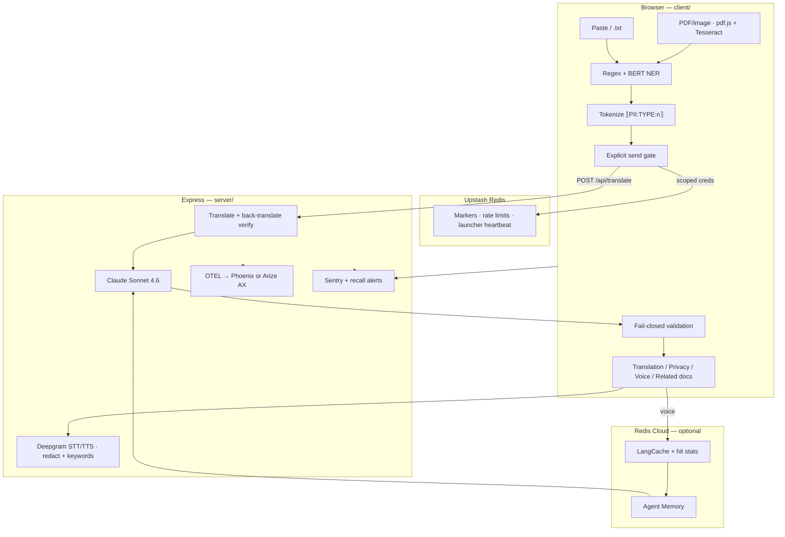

# Passage — Project Architecture & File Reference

**Passage** is a UC Berkeley AI Hackathon 2026 (World Track) demo: paste U.S. immigration correspondence, detect and redact PII in the browser, translate and explain it via Claude in 11 languages, then ask follow-up questions by voice — with an **inspectable privacy boundary** (best-effort detection, fail-closed output validation, per-type recall metrics) and **translation quality checks** (back-translation, immigration glossary).

This document describes the system architecture, every source file in the repository, what each file depends on, and an honest assessment of what is technically strong versus what is conventional or hackathon-scoped.

---

## Table of contents

1. [High-level architecture](#high-level-architecture)
2. [Technology stack](#technology-stack)
3. [Privacy and data flow](#privacy-and-data-flow)
4. [Application workflow](#application-workflow)
5. [UI localization (i18n)](#ui-localization-i18n)
6. [API surface](#api-surface)
7. [Complete file reference](#complete-file-reference)
8. [Technical assessment](#technical-assessment)
9. [Known limitations and duplication](#known-limitations-and-duplication)

---

## High-level architecture

Passage is a **monorepo** with four packages:

| Surface | Role |
|---------|------|
| **Client** (`client/`) | React 19 + Vite SPA — detection, redaction, client-side extract, UI, voice |
| **Server** (`server/`) | Express API — Claude, Deepgram, Redis, observability |
| **Shared** (`shared/`) | `@passage/shared` — `sentry-scrub`, `explanation-text` (no drift) |
| **Launcher** (`launch.mjs`, `Launch Passage.app`) | Docker Phoenix, dev servers, browser lifecycle |



**The architectural bet:** redaction is a **boundary on what leaves the browser to external APIs**, not a categorical detection guarantee. Detection is best-effort (regex + CoNLL-2003 NER); output validation and back-translation checks fail closed. Tokens are preserved through Claude; the UI shows tokenized text by default (local reinsert from `tokenMap` is privacy-neutral but not enabled in demo UI).

---

## Technology stack

| Layer | Choices |
|-------|---------|
| **Shared** | `@passage/shared` — Sentry scrub + explanation-text extraction |
| **Client runtime** | React 19, TypeScript, Vite 6 |
| **Client extract** | `pdfjs-dist`, `tesseract.js` — in-browser PDF/image OCR |
| **UI localization** | `client/src/i18n/` — 11 locale packs |
| **In-browser ML** | `@huggingface/transformers` — `Xenova/bert-base-NER` (CoNLL-2003) |
| **Voice** | `@deepgram/sdk` — Nova-3 STT (redact + keywords), Aura-2 TTS |
| **Server** | Express 4, TypeScript, `tsx` for dev |
| **LLM** | Anthropic SDK — `claude-sonnet-4-6`; structured tool output + prompt caching |
| **Session store** | Upstash Redis — markers, rate limits, launcher heartbeat |
| **Optional memory/cache** | Redis Cloud Agent Memory + LangCache |
| **Observability** | OpenTelemetry + OpenInference; Phoenix or Arize AX |
| **Errors** | Sentry (browser + Node) via `@passage/shared/sentry-scrub` |
| **Verification** | Node/tsx scripts + Playwright E2E privacy audits |

---

## Privacy and data flow

| Stage | Where | Raw PII? | Notes |
|-------|-------|----------|-------|
| Paste | Browser only | Yes | Never sent until user clicks send |
| PDF/image extract | **Browser** (pdf.js + Tesseract.js) | Yes, local | Server fallback only if client fails (rate-limited) |
| Detection | Browser | Yes | Regex + optional on-device NER; **fail-open** — undetected PII passes |
| Redaction | Browser | Replaced with tokens | `PII:TYPE:n` format |
| Pre-send leakage scan | Browser | Block if known patterns remain | Re-checks same pattern classes as detection |
| Session registration | Upstash via scoped creds | No | Marker + rate limits + launcher heartbeat |
| Translate payload | Server → Claude | Tokens only | Structured tool output + glossary + prompt caching |
| Back-translation verify | Server → Claude | Tokens only | Dates/deadlines diff — fail-closed |
| Post-Claude validation | Browser | Fail-closed | Token check + raw-leak scan before render |
| Voice STT | Deepgram | **Raw audio** | Transcript redacted in browser before Claude; STT redact + keyword boost |
| Voice answer | Browser | Tokens only | TTS uses explanation section, also tokenized |
| Agent Memory / LangCache | Redis Cloud | Redacted text only | LangCache hit rate returned to UI |
| Sentry / OTEL | External | Scrubbed / metrics only | Per-type recall spans; recall-drop alerts |

---

## Application workflow

Phases are driven by `usePassageFlow` (`client/src/hooks/usePassageFlow.ts`):

```
input → (optional edit) → preview → translating → done | blocked
```

### Landing and language

1. **Landing scroll** — hero + about copy; **language picker** (`LanguageSelect` on `LandingScroll`) sets `langCode` before the user pastes a document. Choice persists via `locale-storage.ts` (`localStorage`).
2. **UI locale** — derived from `langCode` via `uiLocaleFromLangCode()`; nav, redaction review, tabs, voice controls, loading overlays, connection-lost screen, and TTS warnings all use `t()` / `tf()` from `useUiLocale`.
3. **Get started** — scrolls to the paste/upload tool (`InputPhase`).

### Redaction through results

4. **Input** — paste, upload `.txt` (client-only), or upload PDF/image (**client-side** extract; server fallback); optional synthetic demo chips.
5. **Analyze** — in-browser detection (regex + optional NER); scroll resets to top so **scrubbed preview** is visible first.
6. **Edit** (optional) — full-screen manual span marking (`EditRedactPhase`) or collapsed **optional manual redact** panel on Privacy tab; both use `ManualRedactToolbar` with optional **match-all** for repeated strings (`manual-match.ts`).
7. **Privacy preview** — per-type counts, token highlights, send gate, expandable Claude payload.
8. **Send for translation** — rate-limit check, mint session, register marker, POST redacted text; server runs translate + back-translation verify.
9. **Results tabs** — Translation (side-by-side tokens + TTS), Privacy (audit), Voice Q&A, Related documents (prefetched).

Planted demo documents intentionally trigger **detection gaps** (address leak) or **validation failures** (Claude token mismatch) for live Sentry/observability beats.

---

## UI localization (i18n)

| Piece | Location | Behavior |
|-------|----------|----------|
| **Core strings** | `client/src/i18n/strings.ts` | Base English + per-locale overrides (`en`, `es`, `fr`, `zh`, `vi`, `ko`, `pt`, `ar`, `hi`, `tl`, `uk`) |
| **Locale persistence** | `client/src/i18n/locale-storage.ts` | `readPersistedLangCode()` / `persistLangCode()` — survives connection-lost screen |
| **Workflow UI** | `client/src/i18n/workflow-ui.ts` | Redaction, edit, loading, PII labels, upload errors — merged at build |
| **Voice / TTS UI** | `client/src/i18n/voice-tts-ui.ts` | Voice tab + `ExplanationTts` bar strings — merged at build |
| **Hook** | `client/src/i18n/useUiLocale.ts` | `t(key)`, `tf(key, {vars})` for placeholder substitution |
| **Panel labels** | `client/src/lib/languages.ts` → `PANEL_LABELS` | Translation tab pane labels in document target language |
| **RTL** | `PassageApp.tsx` | `document.documentElement.dir = rtl` when `uiLocale === "ar"` |

**Related documents** and **server Claude prompts** receive `target_language` (English name from `langCode`, e.g. `"Spanish"`) so generated process names and document descriptions match the user's chosen language.

Verification: `client/scripts/verify-ui-locale-default.mjs` (language picker on landing; `uiLocale` follows `langCode`).

---

## API surface

| Method | Path | Purpose |
|--------|------|---------|
| `GET` | `/api/health` | Launcher startup probe |
| `POST` | `/api/launcher/heartbeat` | Browser tab alive signal |
| `GET` | `/api/launcher/session` | Heartbeat timestamp for launcher shutdown |
| `POST` | `/api/launcher/goodbye` | Explicit tab close |
| `POST` | `/api/redaction-session-token` | Mint scoped Upstash credentials |
| `POST` | `/api/translate` | Redacted text → Claude; back-translation verify; rate-limited |
| `POST` | `/api/extract-document` | PDF/image → text (**server fallback**; rate-limited) |
| `POST` | `/api/related-documents` | Redacted text + `target_language` → process + doc types |
| `POST` | `/api/score-redaction` | Recall + `recall_by_type` → OTEL; Sentry on threshold breach |
| `POST` | `/api/deepgram-token` | Short-lived Deepgram grant or server-proxy flag |
| `POST` | `/api/voice/question` | Redacted context + question → answer + TTS text |
| `POST` | `/api/voice/speak` | Tokenized text → MP3 |
| `POST` | `/api/voice/transcribe` | Raw audio → transcript (server-proxy STT) |

Vite dev server proxies `/api/*` → `http://localhost:3001` (`client/vite.config.ts`).

---

## Complete file reference

Files are grouped by directory. **Excluded:** `node_modules/`, `package-lock.json`, `.passage-launch.log`, and `Launch Passage.app/Contents/_CodeSignature/*` (Apple code-signing blobs — not source).

### `shared/` — `@passage/shared`

| File | Purpose | Assessment |
|------|---------|------------|
| `package.json` | Workspace package; re-exported by client + server | Monorepo glue |
| `sentry-scrub.ts` | Regex scrub of PII patterns from Sentry event text/extras | **Single source** — no client/server drift |
| `explanation-text.ts` | Extract explanation section from Claude output; TTS voice map | **Single source** — shared by client TTS UI + server TTS |

Client and server import via `@passage/shared/*`; thin re-export shims remain in `client/src/lib/` and `server/src/lib/`.

### Repository root

| File | Purpose | Assessment |
|------|---------|------------|
| `shared/` | `@passage/shared` — `sentry-scrub.ts`, `explanation-text.ts` | **Shared package** — eliminates client/server drift |
| `launch.mjs` | Main launcher: observability picker, Docker, dev servers, heartbeat shutdown | **Impressive** — lifecycle orchestration |
| `package.json` | Root npm scripts: `launch`, `install:all` | Boilerplate |
| `README.md` | Setup, architecture, privacy model, verification commands | **Strong docs** |
| `PROJECT_ARCHITECTURE.md` | This document | Meta |
| `docker-compose.phoenix.yml` | Phoenix on port 6006 | Standard compose |
| `.gitignore` | Ignores secrets, build artifacts, logs | Standard |
| `08-error-log.md` | Known failures and planted demo behaviors | Operational notes |
| `09-demo-script.md` | Timed judge rehearsal script | Demo ops |
| `passage V2 Draft.html` | Static HTML/CSS design prototype | Design artifact |
| `Launch Passage.app/` | macOS double-click launcher | Practical packaging |

### `scripts/`

| File | Purpose | Uses | Assessment |
|------|---------|------|------------|
| `fix-launch-app.sh` | macOS Gatekeeper: chmod launcher, strip quarantine (`xattr`), ad-hoc `codesign` on `.app` | bash, codesign | Practical ops — needed for double-click launch |

### `client/` — configuration & entry

| File | Purpose | Uses | Assessment |
|------|---------|------|------------|
| `index.html` | Vite HTML shell, font/icon links, `#root` mount | Vite → `/src/main.tsx` | Boilerplate |
| `vite.config.ts` | React plugin; `@passage/shared` alias; proxies `/api` to `:3001` | Standard Vite setup |
| `package.json` | React 19, Deepgram, Transformers.js, pdfjs-dist, tesseract.js, Playwright | Standard |
| `tsconfig.json` | Strict browser TS (ES2022, bundler resolution) | — | Standard |
| `.env.local.example` | Template for optional `VITE_SENTRY_CLIENT_DSN` | — | Boilerplate |

### `client/src/` — application entry

| File | Purpose | Uses | Assessment |
|------|---------|------|------------|
| `main.tsx` | Bootstrap: init Sentry, import CSS, render `App` in StrictMode | `react-dom`, `./lib/sentry`, `./App`, CSS | Boilerplate entry |
| `App.tsx` | Dev-only `?detection-test` → `DetectionTest`; else `PassageApp` | `./ui/*` | Clean dev/prod split |
| `vite-env.d.ts` | Types for `import.meta.env` (Sentry DSN) | `vite/client` | Boilerplate |

### `client/src/lib/` — privacy pipeline & integrations

| File | Purpose | Uses | Assessment |
|------|---------|------|------------|
| `types.ts` | Domain types: PII kinds, spans, redaction results, translate/validation shapes | — | Well-structured shared types |
| `patterns.ts` | Hand-written regex: A-number, SSN, DOB, passport (label-anchored), address heuristics; leakage scan | — | **Impressive** — careful immigration-specific heuristics |
| `detect.ts` | Orchestrates regex + optional NER; merges and validates spans | `patterns`, `ner`, `merge-spans`, `validate-spans` | **Core** — graceful NER degradation |
| `ner.ts` | On-device BERT NER via Transformers.js (`Xenova/bert-base-NER`); singleton pipeline | `@huggingface/transformers` | **Impressive** — real browser-local ML, zero server round-trip |
| `merge-spans.ts` | Resolves overlapping spans by type priority (PASSPORT > A_NUMBER > … > ADDRESS) | `./types` | Solid algorithm |
| `validate-spans.ts` | Filters junk NER spans (max length, fraction of document) | `./types` | Thoughtful guardrails |
| `redact.ts` | Left-to-right replacement with `PII:TYPE:n`; session-scoped counters | `./types` | **Core privacy primitive** |
| `leakage.ts` | Catches undetected address patterns (planted `Apt #4B` demo case) | `./patterns` | Targeted demo guard |
| `validate.ts` | Fail-closed validation: token preservation + raw-leak scan for translate/voice; Sentry on failure | `@sentry/react`, `sentry-scrub`, `types` | **Impressive** — dual validation, blocks partial render |
| `explanation-text.ts` | Re-export from `@passage/shared/explanation-text` | shared | TTS section extraction |
| `prepare-voice-question.ts` | Redacts voice transcript before any network call | `detect`, `redact` | Voice privacy boundary |
| `voice.ts` | Deepgram STT with `redact` + keyword boost; Q&A fetch | `@deepgram/sdk` | Defense-in-depth voice |
| `languages.ts` | 11 languages; STT/TTS metadata; `PANEL_LABELS` | — | Clean config |
| `manual-match.ts` | Exact-string search for manual redact match-all | — | Small helper |
| `extract-document.ts` | **Client-side** pdf.js + Tesseract; server fallback | `pdfjs-dist`, `tesseract.js` | Primary upload path is local |
| `api-fetch.ts` | Fetch wrapper + connection-lost detection | — | Resilience |
| `redis.ts` | Scoped Upstash creds; PII-free session marker | Upstash REST | Scoped creds pattern |
| `score-redaction.ts` | `computeRecall`, **`computeRecallByType`**, threshold alert | `/api/score-redaction` | Per-type metrics bridge |
| `sentry.ts` | Browser Sentry init with scrub hook | `@passage/shared`, `@sentry/react` | Standard |
| `sentry-scrub.ts` | Re-export from `@passage/shared/sentry-scrub` | shared | No duplication |
| `errors.ts` | `formatError()` for safe user-facing messages | — | Small utility |
| `audit-cases.ts` | Detection QA cases + evaluator (planted failures, overlaps, names) | `./types` | **Impressive** — built-in audit harness |

### `client/src/i18n/`

| File | Purpose | Uses | Assessment |
|------|---------|------|------------|
| `strings.ts` | Core UI string keys, locale tables, `t()` / `tf()` / `piiLabel()` / `uiLocaleFromLangCode()` | merges `workflow-ui`, `voice-tts-ui` | **Core** — single source for chrome copy |
| `locale-storage.ts` | Persist `langCode` in `localStorage` for connection-lost and return visits | — | Small persistence layer |
| `workflow-ui.ts` | Redaction, edit, loading, upload error strings (all 11 locales) | merged into `strings.ts` | Large patch file — keeps strings.ts readable |
| `voice-tts-ui.ts` | Voice tab + TTS bar strings (all 11 locales) | merged into `strings.ts` | Voice/translation listen UX copy |
| `useUiLocale.ts` | React hook: `t(key)`, `tf(key, vars)` | `strings.ts` | Standard i18n hook |

### `client/src/data/`

| File | Purpose | Uses | Assessment |
|------|---------|------|------------|
| `synthetic-docs.ts` | 9 synthetic docs (7 hand-labeled + 2 planted failures) with expected spans | `../lib/types` | **Impressive** — ground truth for recall demos |

### `client/src/hooks/`

| File | Purpose | Uses | Assessment |
|------|---------|------|------------|
| `usePassageFlow.ts` | Central state machine: detect → edit → preview → translate → voice; recall scoring; validation failures; **prefetch related documents** on translate success | All lib modules, `SYNTHETIC_DOCS`, Sentry | **Impressive** — orchestrates entire product flow |
| `useLauncherSession.ts` | Periodic heartbeat + goodbye beacons so launcher stops when browser tab closes | `fetch` → launcher API | Clever lifecycle integration |

### `client/src/ui/`

| File | Purpose | Uses | Assessment |
|------|---------|------|------------|
| `PassageApp.tsx` | Main shell: nav, phase strip, landing scroll, phase routing, scroll-to-top on preview, **connection-lost gate** + health ping, footer, loading overlays, toasts, `lang`/`dir` on `<html>` | hooks, phase components, i18n | **Polished** workflow UX |
| `LandingScroll.tsx` | Scroll landing hero + about; embeds `LanguageSelect`; get-started scroll to tool | `LanguageSelect`, i18n | **Entry UX** — language before paste |
| `LanguageSelect.tsx` | Shared translation-language `<select>` (landing + reusable) | `LANGUAGES`, flow hook, i18n | Small shared control |
| `InputPhase.tsx` | Paste area, file upload zone, synthetic doc chips, analyze (no language picker — moved to landing) | `FileUploadZone`, flow hook, i18n | Standard form phase |
| `FileUploadZone.tsx` | Drag/drop `.txt` / PDF / image; **client-side extract** (toast on server fallback) | `extract-document`, i18n | Upload without server privacy gate |
| `ManualRedactPanel.tsx` | Collapsible optional manual PII marks on Privacy tab | `ManualRedactToolbar`, flow hook, i18n | Human-in-the-loop without dominating preview |
| `ManualRedactToolbar.tsx` | Shared toolbar: PII type picker, match-all prompt, commit/cancel | `manual-match`, flow hook, i18n | Reused by edit + privacy manual redact |
| `ConnectionLostView.tsx` | Server unreachable recovery UI (localized retry; no start-over while disconnected) | i18n | Resilience |
| `EditRedactPhase.tsx` | Full-screen manual span selection via `ManualRedactToolbar`, re-analyze | flow hook, i18n | **Useful** — human-in-the-loop redaction |
| `PrivacyTab.tsx` | PII sidebar, token highlights, send gate, optional manual redact `<details>`, expandable Claude payload inspector | `./helpers`, i18n, `ManualRedactPanel` | **Impressive** — transparency for judges/devtools |
| `AnalysisView.tsx` | Tab container: Translation / Privacy / Voice / **Related documents** | sub-tabs, i18n | Layout glue |
| `TranslationTab.tsx` | Side-by-side tokenized source/translation; validation failure panel; `ExplanationTts` with localized listen label | `ExplanationTts`, `PANEL_LABELS`, `./helpers` | Core results view |
| `RelatedDocumentsTab.tsx` | Displays prefetched process + doc list from flow state (loading/error/empty i18n) | flow hook, i18n | Informational tab — no raw PII |
| `VoiceTab.tsx` | Mic STT, question redaction preview, Claude Q&A, optional **auto-play answer** checkbox, TTS playback | `prepareVoiceQuestion`, `voice`, `validate`, `ExplanationTts`, i18n | **Impressive** — end-to-end voice privacy |
| `ExplanationTts.tsx` | Play/pause TTS for tokenized explanation text; localized fallback-voice warning | `explanation-text`, `voice`, i18n | **Good** — manual listen + translated warnings |
| `LoadingState.tsx` | Reusable spinner (inline / panel / overlay variants) | React | Small reusable component |
| `motion.tsx` | `RiseIn` scroll/mount animations, `CountUp` for stats | React | Landing + workflow polish |
| `helpers.tsx` | Token highlight rendering, PII badges, colors, tooltips | React, `./types` | Shared UI utilities |
| `DetectionTest.tsx` | Dev harness (`?detection-test`): detect, audit suite, fetch monitor, span debug | `audit-cases`, `detect`, `ner`, etc. | **Impressive** — QA dashboard in-app |
| `DetectionTest.css` | Styles for detection test harness | — | Dev-only CSS |

### `client/src/styles/`

| File | Purpose | Uses | Assessment |
|------|---------|------|------------|
| `passage-v2.css` | Base design system from HTML draft (~505 lines): colors, nav, hero, buttons | CSS custom properties | **Strong visual identity** |
| `passage-app.css` | App-specific overrides (~1,900 lines): workflow, landing scroll, voice, tabs, loading, i18n layout | `--nav-height` vars from v2 | **Substantial** — not a component library, raw CSS |

### `client/scripts/` — verification & demo automation

| File | Purpose | Uses | Assessment |
|------|---------|------|------------|
| `verify-regex-node.mjs` | Smoke test regex detection (no NER) | tsx → `detect.ts` | Standard unit smoke |
| `verify-redact.mjs` | Smoke test tokenization | detect, merge, redact | Standard |
| `verify-validation.mjs` | Unit tests for token/leak validation | `validate.ts` | Standard |
| `verify-detection.mjs` | Playwright: DetectionTest UI + audit suite | Playwright | **Strong** E2E detection QA |
| `verify-demo-network.mjs` | Playwright: assert no raw PII in API request bodies | Playwright | **Impressive** — automated privacy audit |
| `verify-tokenized-ui.mjs` | Playwright: translation pane shows tokens, not raw values | Playwright | Privacy E2E |
| `verify-explanation-tts.mjs` | Unit test explanation extraction + voice mapping | `explanation-text.ts` | Targeted safety |
| `verify-voice-redaction.mjs` | Voice transcript redaction cases; documents known gaps | `prepare-voice-question.ts` | **Honest** — admits STT redaction limits |
| `verify-upload-redaction.mjs` | Extracted upload text must redact before translate payload | `patterns`, `redact` | Upload privacy guard |
| `verify-name-detection.mjs` | Western + **non-Latin name gap** cases; synthetic doc regression | `detect`, synthetic docs | Honest detection QA |
| `verify-ui-locale-default.mjs` | Guards: language picker on landing; `uiLocale` derives from `langCode`; connection-lost i18n | reads hook + UI sources | i18n regression guard |
| `verify-connection-lost.mjs` | Playwright: connection-lost screen (client dev server only, no server) | Playwright | Resilience E2E |
| `trigger-sentry-browser.mjs` | Playwright: mock bad translate → fail-closed UI beat | Playwright | Demo automation |
| `capture-planted-translate-payload.mjs` | Playwright: Apt #4B doc blocks send (no translate call) | Playwright | Demo automation |

---

### `server/` — configuration

| File | Purpose | Uses | Assessment |
|------|---------|------|------------|
| `package.json` | Server deps and test/score scripts | Express, Anthropic, OTEL, Phoenix, Sentry, Redis | Standard |
| `tsconfig.json` | NodeNext ESM, strict, emits `dist/` | — | Standard |
| `.env.example` | Documented template for all secrets and observability targets | — | **Well-documented** env reference |

### `server/src/` — entry & bootstrap

| File | Purpose | Uses | Assessment |
|------|---------|------|------------|
| `index.ts` | Express app: CORS, JSON + raw audio routes, health, wires all route handlers, startup checks | express, cors, dotenv, routes, `startup.ts`, Sentry | Clean entry point |
| `startup.ts` | Fail-fast: ping Upstash/TCP Redis; Claude “hello” probe | `@anthropic-ai/sdk`, `@upstash/redis`, `redis` | **Good** — refuses to start without creds |
| `instrumentation.ts` | Side-effect import: init OTEL before routes load | `./lib/observability` | Standard OTEL pattern |

### `server/src/lib/` — business logic

| File | Purpose | Uses | Assessment |
|------|---------|------|------------|
| `claude.ts` | Translate + voice Q&A; **structured tool output**, glossary, prompt caching, back-translation verify | `@anthropic-ai/sdk` | **Impressive** — translation quality + privacy |
| `translation-verify.ts` | Date/deadline diff after back-translation | — | **Core** — fail-closed meaning check |
| `immigration-glossary.ts` | USCIS/EOIR terms for Claude system prompt | — | Translation accuracy |
| `session-store.ts` | Upstash launcher heartbeat + per-session rate limits | `@upstash/redis` | **Production-minded** Redis use |
| `deepgram-keywords.ts` | STT keyword boosting + redact query params | — | Defense-in-depth for voice |
| `deepgram.ts` | Mint client token, server-proxy STT/TTS, PII safety asserts on TTS input | Deepgram REST, `./explanation-text` | **Good** — grant vs proxy fallback |
| `redis.ts` | Upstash REST config, TCP helper, session key naming | `@upstash/redis`, `redis` | Clean abstraction |
| `sentry.ts` | Server Sentry + validation/meaning/recall capture helpers | `@passage/shared`, `@sentry/node` | Recall-drop alerts |
| `sentry-scrub.ts` | Re-export from `@passage/shared/sentry-scrub` | shared | No duplication |
| `explanation-text.ts` | Re-export from `@passage/shared/explanation-text` | shared | Server TTS extraction |
| `lang-cache.ts` | LangCache semantic cache; **hit/miss stats** + similarity on hit | `./agent-memory` | Cache metrics in voice API |
| `score-redaction.ts` | Emits `redaction-check` OTEL spans with **per-type recall** | `@opentelemetry/api` | Measurable detection quality |
| `detection-patterns.ts` | Regex-only detection + `computeRecallByType` for batch scripts | — | Script support; no NER |
| `agent-memory.ts` | Redis Cloud Agent Memory; redacted voice turns only | `fetch` | Safety asserts before persist |
| `related-documents.ts` | Claude JSON: process + 5–8 doc types; localized labels | `@anthropic-ai/sdk` | Informational tab |
| `document-extract.ts` | PDF/OCR **server fallback only**; 10 MB limit | `pdfjs-dist`, `tesseract.js` | Fallback — client extract is primary |
| `observability/index.ts` | Dual-target OTEL init: Phoenix vs Arize AX based on env | `./phoenix`, `./ax` | **Impressive** — pluggable observability |
| `observability/phoenix.ts` | Phoenix OTEL registration + Anthropic auto-instrumentation | `@arizeai/phoenix-otel`, OpenInference Anthropic | Sponsor integration |
| `observability/ax.ts` | Arize AX OTLP exporter + Anthropic instrumentation | `@opentelemetry/*`, OpenInference | Sponsor integration |

### `server/src/routes/`

| File | Purpose | Uses | Assessment |
|------|---------|------|------------|
| `translate.ts` | Translate + back-translation verify + rate limit; token check | `claude`, `session-store`, `sentry` | Core API |
| `redaction-session-token.ts` | Mint scoped Upstash REST credentials for browser session marker | `../lib/redis`, `node:crypto` | Privacy-critical API |
| `score-redaction.ts` | Accept recall + `recall_by_type`; OTEL span + Sentry threshold | `score-redaction`, `sentry` | Metrics API |
| `deepgram-token.ts` | Short-lived Deepgram grant or `{ serverProxy: true }` | `deepgram` | Voice auth API |
| `voice-question.ts` | LangCache → Agent Memory → Claude; cache stats in response | agent-memory, lang-cache, claude | Tiered voice stack |
| `voice-speak.ts` | TTS → MP3 | `deepgram` | Thin proxy |
| `voice-transcribe.ts` | Server-proxy STT (redact + keywords) | `deepgram` | Fallback STT path |
| `extract-document.ts` | **Server fallback** PDF/image handler (rate-limited) | `document-extract`, `session-store` | Fallback only |
| `related-documents.ts` | POST handler: validates `redacted_text`, passes `target_language` to Claude | `../lib/related-documents` | Related docs tab API |
| `launcher-session.ts` | Launcher heartbeat/goodbye via **Upstash Redis** | `session-store.ts` | Durable across server restarts |

### `server/src/data/`

| File | Purpose | Uses | Assessment |
|------|---------|------|------------|
| `synthetic-docs.json` | JSON mirror of client synthetic docs for batch scoring scripts | — | Data duplication from TS source |

### `server/scripts/` — integration tests & ops

| File | Purpose | Uses | Assessment |
|------|---------|------|------------|
| `test-phases.ts` | Phases 1–4: regex, Redis session, Claude translate, validation, planted failure | claude, redis, sentry; live `:3001` | **Impressive** integration suite |
| `test-phase5.ts` | Observability reachability + score-redaction API + batch recall runs | instrumentation, observability | Sponsor track tests |
| `test-phase6.ts` | Deepgram token, TTS PII guard, voice question/speak endpoints | deepgram; live `:3001` | Voice integration tests |
| `test-explanation-text.ts` | Server-side explanation extraction unit test | `explanation-text.js` | Small unit test |
| `test-document-extract.ts` | PDF/image extraction smoke test | `document-extract.js` | Upload path unit test |
| `score-redaction-set.ts` | Batch score all synthetic docs → OTEL spans for trend comparison | detection-patterns, score-redaction, synthetic-docs.json | **Impressive** benchmarking tool |
| `trigger-sentry-validation.mjs` | Fire Sentry event with token keys only; writes audit JSON | `@sentry/node`, `@passage/shared` | Demo/audit tooling |
| `audit-sentry-payload.mjs` | Scan exported Sentry JSON for forbidden raw PII strings | `node:fs` | Privacy audit script |
| `export-eval-dataset.mjs` | Export synthetic doc metadata → `eval-dataset.jsonl` for Arize | `synthetic-docs.json` | Eval dataset bridge |

---

## Technical assessment

### What is genuinely impressive

1. **Privacy as architecture, not marketing** — Fail-closed output validation, back-translation checks, per-type recall, and Playwright network audits form a coherent **inspectable** boundary. Detection is honestly best-effort.

2. **Translation quality** — Back-translation verification, immigration glossary, and structured Claude output address real user harm (missed deadlines) — not just privacy theater.

3. **Browser-local NER + client-side extract** — Transformers.js NER and pdf.js/Tesseract extraction keep raw bytes local when the client path succeeds.

4. **Verification depth** — Playwright tests inspect network payloads and DOM; per-type recall in OTEL/Sentry.

5. **Redis with real jobs** — Launcher heartbeat, rate limits, session markers — not just sponsor checkboxes.

6. **Deepgram defense-in-depth** — STT redaction flags + keyword boosting; raw audio exposure documented honestly.

7. **Shared `@passage/shared` package** — Single source for `sentry-scrub` and `explanation-text`.

### What is conventional or hackathon-scoped

1. **Demo scope** — No user auth; session-scoped rate limits only; dev Vite proxy; not multi-tenant production.

2. **Synthetic docs duplicated** — `client/src/data/synthetic-docs.ts` ↔ `server/src/data/synthetic-docs.json`.

3. **Detection floor** — CoNLL-2003 NER + Latin-centric regex; non-Latin names tracked via `recall.name`.

4. **Voice / Deepgram** — Raw audio reaches Deepgram; post-STT browser redaction before Claude.

5. **Claude-centric backend** — Related-documents is one-shot informational; no RAG or legal-grade QA.

6. **Translation quality** — Back-translation helps but is not a substitute for human review of deadlines.

### Summary verdict

| Dimension | Rating | Notes |
|-----------|--------|-------|
| **Privacy engineering** | Strong | Fail-closed output + honest detection floor + per-type metrics |
| **Detection quality** | Good (demo) | NAME recall weakest on non-Latin scripts — measured, not hidden |
| **Translation quality** | Improved | Back-translation + glossary; still not legal-grade |
| **UX / polish** | Strong for hackathon | Client-side upload extract; tokenized display (local reinsert optional) |
| **Backend sophistication** | Moderate+ | Rate limits, meaning verification, structured Claude output |
| **Test / verify tooling** | Strong | Playwright privacy audits + non-Latin name gap tests |
| **Production readiness** | Low | By design — demo and judge narrative first |

---

## Known limitations and duplication

| Issue | Detail |
|-------|--------|
| **Synthetic docs** | TS source + JSON mirror for server batch scripts — update both |
| **Shared logic** | `@passage/shared` for scrub + explanation text |
| **Launcher session** | Upstash Redis via `session-store.ts` — survives server restart |
| **Upload path** | Primary: client pdf.js + Tesseract; fallback: `/api/extract-document` |
| **NER first load** | Large model download on first analyze |
| **Legal scope** | Explains documents; explicitly avoids response drafting |
| **Display** | Tokenized by default; `tokenMap` reinsert is privacy-neutral (not in demo UI) |

---

## Related documentation

- [`README.md`](README.md) — setup, run commands, feature list
- [`08-error-log.md`](08-error-log.md) — known failure catalog
- [`09-demo-script.md`](09-demo-script.md) — live demo script

---

*Last updated for phases A–G: honest privacy framing, translation verification, client-side upload, per-type recall, Redis session/rate limits, Deepgram hardening, and `@passage/shared` package.*
