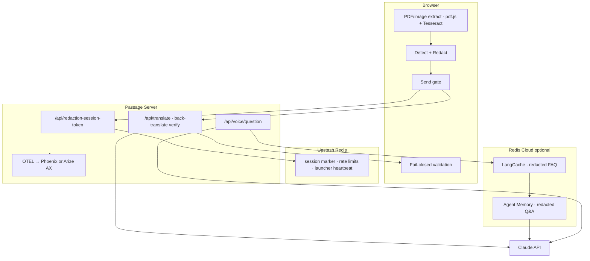

# Passage

**UC Berkeley AI Hackathon 2026 — World Track**

Paste an immigration letter, get it translated and explained in your language, ask follow-up questions by voice — while detected PII is tokenized **before anything reaches Claude**. Output validation **fails closed**; detection is **best-effort** (regex + on-device NER) with per-type recall metrics you can verify in devtools.

The differentiator isn't "we use Claude to translate." It's an **inspectable privacy boundary**: tokenize what we detect (recall-first — we over-redact when uncertain), validate Claude output, measure recall by PII type — plus a **date/deadline back-translation check** that catches the highest-frequency catastrophic translation error.

---

## First-time setup

1. **Install dependencies** (once):

```bash
npm run install:all
```

2. **Copy env files** and fill in keys:

```bash
cp server/.env.example server/.env
cp client/.env.local.example client/.env.local   # optional — browser Sentry
```

3. **Required in `server/.env`:**

| Variable | Purpose |
|---|---|
| `ANTHROPIC_API_KEY` | Claude translation + voice Q&A |
| `UPSTASH_REDIS_REST_URL` | Upstash — session markers, launcher heartbeat, rate limits |
| `UPSTASH_REDIS_REST_TOKEN` | Upstash REST credentials |
| `SENTRY_DSN` | Server error monitoring |
| `DEEPGRAM_API_KEY` | Voice transcription + TTS |
| `RECALL_ALERT_THRESHOLD` | Optional (default `0.75`) — Sentry alert when recall or NAME recall drops below |

For **Arize AX Cloud** traces with `npm run launch -- --cloud`, also set `ARIZE_SPACE_ID` and `ARIZE_API_KEY` ([app.arize.com](https://app.arize.com) → Settings).

**Optional Redis Cloud** (voice memory + FAQ cache — redacted text only):

| Variable | Purpose |
|---|---|
| `AGENT_MEMORY_URL` + `AGENT_MEMORY_STORE_ID` + `AGENT_MEMORY_API_KEY` | Multi-turn voice Q&A |
| `LANGCACHE_URL` + `LANGCACHE_CACHE_ID` + `LANGCACHE_API_KEY` | Semantic cache for repeated voice questions |

4. **macOS only — allow double-click launch** (once):

```bash
./scripts/fix-launch-app.sh
```

If macOS still warns, right-click **Launch Passage.app** → **Open** → **Open** once.

---

## Run Passage

**After setup, start Passage one of these ways** (both use the same launcher — server, client, observability picker, and auto-shutdown when you close the browser tab):

| Method | How |
|---|---|
| **macOS app** | Double-click **`Launch Passage.app`** in the repo root |
| **Terminal** | From the repo root: `npm run launch` |

Optional flags (terminal only): `--cloud` for Arize AX Cloud traces, `--local` for local Phoenix (Docker). On macOS, the app shows a dialog to pick observability instead.

```bash
npm run launch                       # default — observability picker (app) or Phoenix (terminal)
npm run launch -- --cloud            # Arize AX Cloud traces
# npm run launch -- --local          # Local Phoenix (Docker) instead
```

Re-run `./scripts/fix-launch-app.sh` only if macOS blocks the app again — not needed for every launch.

Browser opens at **http://localhost:5173**. Pick your **translation language** on the landing screen first — the whole UI (nav, redaction review, tabs, voice controls, warnings) follows that choice. **Close that tab** when you are done — the launcher stops server and client automatically.

Logs if something fails: `.passage-launch.log`

**Port conflict?** If voice or API calls fail, kill any stale server:

```bash
lsof -ti:3001 | xargs kill
npm run launch -- --cloud
```

---

## Configure secrets (reference)

The server refuses to start without working Redis and Claude credentials. See [First-time setup](#first-time-setup) for the required variables.

### Observability — pick one at launch

| Mode | Set in `.env` | Where to get keys |
|---|---|---|
| **Local Phoenix** (default) | `OBSERVABILITY_TARGET=phoenix` | No keys needed — Docker only |
| **Arize AX Cloud** | `OBSERVABILITY_TARGET=ax` | [app.arize.com](https://app.arize.com) → **Settings** → **Space ID** + **API Key** |

```bash
# Local Phoenix
OBSERVABILITY_TARGET=phoenix
PHOENIX_COLLECTOR_ENDPOINT=http://localhost:6006
PHOENIX_PROJECT_NAME=immigration-redaction-demo

# Arize AX Cloud
OBSERVABILITY_TARGET=ax
ARIZE_SPACE_ID=your-space-id
ARIZE_API_KEY=your-api-key
ARIZE_PROJECT_NAME=immigration-redaction-demo
```

Both modes use the same OpenTelemetry + OpenInference stack — Claude traces and `redaction-check` recall spans work identically; only the export destination changes.

**Launcher vs `.env`:** `Launch Passage.app` / `launch.mjs` asks which backend to use (macOS dialog) or accepts `--local` / `--cloud`. That choice is passed to the server for that session and **overrides** `OBSERVABILITY_TARGET` in `.env`. For `npm run dev` without the launcher, `.env` controls the target.

### Redis Agent (optional — voice memory + FAQ cache)

Create both services at [cloud.redis.io](https://cloud.redis.io) when you want multi-turn voice or cache hits. Only redacted/tokenized text is stored.

### Client (`client/.env.local`)

| Variable | Purpose |
|---|---|
| `VITE_SENTRY_CLIENT_DSN` | Public browser Sentry DSN (optional) |

---

## Architecture



**Boundary model:** detection is **best-effort** (fail-open); everything after send is **fail-closed** (tokens, leaks, meaning drift).

**Redis roles:**

1. **Upstash** (required) — scoped session markers, launcher heartbeat, per-session rate limits
2. **Agent Memory** (optional) — tokenized voice conversation history
3. **LangCache** (optional) — semantic cache for voice FAQ; hit rate + similarity in API response

---

## Hackathon sponsor integrations

### Anthropic (Claude)

**Model:** `claude-sonnet-4-6` via `@anthropic-ai/sdk`.

| Use | Endpoint / location | What goes to Claude |
|---|---|---|
| **Translation + explanation** | `POST /api/translate` → `server/src/lib/claude.ts` | Redacted text with `PII:TYPE:n` tokens only |
| **Date/deadline back-translate** | Same route (automatic) | Second pass — checks dates and "within N days" survive round-trip; **not** general correctness |
| **Voice Q&A** | `POST /api/voice/question` | Redacted document context + redacted question (transcript scrubbed in browser first) |
| **Related documents** | `POST /api/related-documents` | Redacted text + `target_language` (informational one-shot) |

**Claude features:** structured tool output, immigration glossary, prompt caching. Backend is intentionally thin (prompt + API call per feature) — **the sophistication is the privacy architecture**, not model orchestration.

### Redis

Three distinct Redis surfaces — all **PII-free by design**:

| Provider | Required? | Role |
|---|---|---|
| **Upstash** (`UPSTASH_REDIS_REST_*`) | **Yes** | Scoped session markers; **launcher heartbeat** (replaces in-memory store); **per-session rate limits** on translate/voice/extract |
| **Redis Cloud Agent Memory** (`AGENT_MEMORY_*`) | Optional | Multi-turn voice Q&A history — redacted user/assistant turns only (`server/src/lib/agent-memory.ts`). Safety asserts block raw PII before persist. |
| **Redis Cloud LangCache** (`LANGCACHE_*`) | Optional | Semantic cache for paraphrased voice FAQ on the same redacted doc (`server/src/lib/lang-cache.ts`). Responses include hit rate + similarity in API. |

Voice Q&A checks LangCache → Agent Memory → Claude in that order when configured (`server/src/routes/voice-question.ts`).

### Sentry

**Server (required):** `SENTRY_DSN` → `@sentry/node` in `server/src/lib/sentry.ts`. Captures Claude, Deepgram, and API failures via `captureExternalError`.

**Browser (optional):** `VITE_SENTRY_CLIENT_DSN` → `@sentry/react` in `client/src/lib/sentry.ts`.

Shared `sentry-scrub.ts` lives in `shared/` (`@passage/shared`). Typical events: validation mismatches, leakage blocks, **date/deadline drift** blocks, recall-drop alerts, API failures.

### Arize AX (observability)

**Cloud export:** `OBSERVABILITY_TARGET=ax` or `npm run launch -- --cloud` → OTLP traces to Arize AX (`server/src/lib/observability/ax.ts`). Requires `ARIZE_SPACE_ID` + `ARIZE_API_KEY`.

**What gets traced:**

- **Auto-instrumented Claude calls** — `@arizeai/openinference-instrumentation-anthropic` wraps the Anthropic SDK (translate, voice, related docs).
- **Custom `redaction-check` spans** — aggregate recall **and per-type recall** (`redaction.recall.name`, etc.), doc ID, session ID, run ID, detector type (`server/src/lib/score-redaction.ts`)
- **Eval dataset export** — `npm run export:eval-dataset --prefix server` → `server/eval-dataset.jsonl` for Arize AX Datasets

**Local dev alternative:** **Phoenix** (same OpenInference stack, `@arizeai/phoenix-otel`) runs in Docker via `docker-compose.phoenix.yml` — default when launching without `--cloud`. Traces land at `http://localhost:6006`. Phoenix is not a separate integration; it is the local export target for the same OTEL pipeline.

Filter either UI by span name **`redaction-check`** or attribute **`redaction.run_id`**.

### Deepgram (voice)

**STT:** Nova-3 in the document target language. **The text path and audio path are not equivalent:** pasted/uploaded text is redacted before any third party; **spoken audio reaches Deepgram as raw audio** (including spoken PII) before client-side transcript redaction. Defense-in-depth: `redact=pii,numbers`, keyword boosting, mic disclaimer — but the structural exposure remains.

Browser uses a short-lived grant from `POST /api/deepgram-token` when the API key allows it; otherwise audio is proxied through `POST /api/voice/transcribe`.

**TTS:** Aura-2 speaks **tokenized explanation text only** (explanation section extracted server-side; PII safety assert before synthesis). Endpoints: `POST /api/voice/speak` and TTS text returned from voice Q&A.

Mic disclaimer in UI: users should type ID numbers rather than speak them — STT redaction has known gaps (`client/scripts/verify-voice-redaction.mjs`).

---

## What Passage does

**Input:** Paste text, upload a **`.txt`** file (stays in-browser), or upload **`.pdf` / image** (**extracted in-browser** via pdf.js + Tesseract.js; server fallback only if client extraction fails). Synthetic demo documents are available for testing.

**Output:** Plain-language translation + explanation in **11 languages** (English, Spanish, French, Chinese, Vietnamese, Korean, Portuguese, Arabic, Hindi, Tagalog, Ukrainian). UI shows **tokenized** text by default; raw values can be reinserted client-side from in-memory `tokenMap` for readability without changing Claude payloads (not enabled in demo UI). Voice follow-up questions; optional listen-back via TTS — all tokenized to external APIs. **Related documents** tab lists commonly associated immigration document types (redacted input only).

**UI language:** Choose translation language on the **landing screen** before pasting. Site chrome, redaction review, tab labels, voice buttons, and TTS fallback warnings all follow that choice (11 locale packs under `client/src/i18n/`). Your choice is saved in `localStorage` so the connection-lost screen stays in the same language.

**Scope line:** Explains what a section is *asking for*. Does **not** tell anyone what to write in response.

---

## Privacy architecture

| Layer | Behavior |
|---|---|
| **Detection (input)** | **Recall-first** — NER kept at score ≥ 0.35; label-line names include non-Latin scripts; undetected PII still passes |
| **Detection ceiling** | Measuring NAME recall does not fix misses — e.g. 0.6 recall ⇒ ~40% of names may reach Claude |
| **Pre-send scan** | Re-checks known pattern classes only |
| **In-browser extraction** | PDF/image via pdf.js + Tesseract.js (server fallback rate-limited) |
| **Explicit send gate** | Nothing hits the network until **Send for translation** |
| **Claude payload** | Tokens only (for detected spans) |
| **Post-Claude validation** | Token check + raw-leak scan — **fail closed** |
| **Back-translation verify** | **Dates + day-count deadlines only** — fail closed if missing; wrong clause attachment not caught |
| **Voice STT** | Raw audio → Deepgram **before** redaction; transcript redacted before Claude |
| **Per-type recall** | OTEL + Sentry when recall or NAME recall &lt; `RECALL_ALERT_THRESHOLD` |

---

## What we don't claim

Volunteer these in a judged room — credibility beats polish.

| Exposure | Reality |
|---|---|
| **Undetected names** | Best-effort detection with recall-first tuning; names without label anchors or outside NER training can still reach Claude |
| **Raw audio to Deepgram** | Spoken PII hits a third party before redaction; mic disclaimer relies on user compliance |
| **Server extract fallback** | If client-side pdf.js/Tesseract fails, raw file bytes hit the server (rate-limited) |
| **Translation correctness** | Date/deadline back-translate catches one failure mode; it does not verify that form fields or legal meaning are correct |

**Thesis:** the innovation is **what you don't send**, not what the model does. Backend = prompt + API call; privacy architecture + verification harness = the sophistication.

---

## Features built

### Detection & redaction
- **Recall-first policy** — NER threshold 0.35; label-line capture for non-Latin names; prefer over-redaction to leaking names
- 9 synthetic docs (7 hand-labeled + 2 planted failures)
- Privacy tab: per-type counts, confidence, token highlights, expandable Claude payload
- Optional manual redact with **match-all**; per-type recall → observability

### Translation
- Structured tool output, immigration glossary, prompt caching
- **Date/deadline back-translation** — fail-closed if dates or "within N days" vanish (not general QA)
- Fail-closed blocked state (tokens, leaks, or date/deadline check)

### Related documents
- After translation, **prefetches** associated document types in the background (no wait for TTS)
- Claude identifies the immigration process + 5–8 commonly linked document types from **redacted text only**
- Responses localized via `target_language` (matches UI / translation picker)

### Voice
- **Text path ≠ audio path** — see [What we don't claim](#what-we-dont-claim)
- Deepgram Nova-3 STT (all 11 languages); client-side transcript redaction before Claude
- LangCache hit rate + similarity; explanation-only TTS (native Aura-2 for es/fr/pt; English fallback for others)
- Mic disclaimer: type ID numbers, don't speak them (localized)

### Observability (Phoenix + Arize AX)
- Dual-target export — choose at launch
- Auto-instrumented Claude traces
- Custom `redaction-check` spans — aggregate + **per-type recall** (metrics only, no raw PII)
- Batch + live browser scoring; eval dataset export for Arize Datasets

### Error monitoring (Sentry)
- Validation mismatches, leakage blocks, **translation meaning failures**, **recall-drop alerts**
- Claude/Deepgram/voice failures; planted demo doc for live dashboard beat

### Resilience
- Server health ping every 5s; **connection-lost** screen (localized, retry only)
- Launcher heartbeat in **Upstash Redis** — stops server/client when browser tab closes

---

## Verify it works

Keep Passage running (via launcher or separate `npm run dev` in `server/` and `client/`). For Phoenix mode, use the launcher or run `docker compose -f docker-compose.phoenix.yml up -d` first.

`test:phase5` and `test:phase6` call live HTTP endpoints — the server must already be listening on port **3001**.

```bash
cd server
npm run test:phases      # redaction, Redis, Claude, validation + Sentry
npm run test:phase5      # observability + recall scoring
npm run test:phase6      # Deepgram voice + TTS safety
npm run test:explanation-text

cd ../client
npm run verify:all                    # validation, regex, redact, voice, TTS, upload, i18n, names
npm run verify:demo-network           # Playwright — token-only API payloads (needs dev server)
npm run verify:detection              # Playwright — ?detection-test harness
npm run verify:tokenized-ui           # Playwright — no reinsertion in UI
npm run verify:sentry-browser         # Playwright — fail-closed validation beat
node scripts/verify-connection-lost.mjs     # Playwright — connection-lost UI (client only, no server)

npm run score:redaction -- run-before-fix
npm run score:redaction -- run-after-fix   # from server/ — compare trend in observability UI
npm run sync:synthetic-docs --prefix server   # regenerate JSON from client/src/data/synthetic-docs.ts
npm run export:eval-dataset --prefix server   # Arize eval dataset JSONL
```

Filter observability UI by span name **`redaction-check`** or attribute **`redaction.run_id`**.

Failures logged in [`08-error-log.md`](08-error-log.md).

See [`PROJECT_ARCHITECTURE.md`](PROJECT_ARCHITECTURE.md) for the full file reference, data-flow diagrams, and technical assessment.

---

## Vanisha merge note

Verification tooling and detection audit cases from the teammate fork are integrated into this repo. The separate `Vanisha project/` copy was removed after porting.

---

## Demo script

See [`09-demo-script.md`](09-demo-script.md) for the timed 5-minute rehearsal (two distinct failure beats: detection gap vs validation mismatch).

---

## Project structure

```
launch.mjs / Launch Passage.app     — launcher + observability picker + auto-shutdown
scripts/fix-launch-app.sh           — macOS Gatekeeper fix

/shared/                            — @passage/shared (sentry-scrub, explanation-text)
/client/
  src/lib/                          — detection, redaction, validate, voice, extract-document
  src/hooks/usePassageFlow.ts       — phase state machine
  src/ui/                           — landing, redaction, results tabs
  src/i18n/                         — 11 locale packs
/server/
  src/lib/claude.ts                 — structured translate + back-translation verify
  src/lib/translation-verify.ts     — date/deadline diff
  src/lib/immigration-glossary.ts   — USCIS/EOIR terms
  src/lib/session-store.ts          — Redis heartbeat + rate limits
  src/lib/deepgram-keywords.ts      — STT redact + keyword boost
  src/lib/document-extract.ts       — server fallback PDF/OCR only
  src/lib/observability/            — Phoenix + Arize AX
docker-compose.phoenix.yml
PROJECT_ARCHITECTURE.md             — full file reference
```

---

## API surface

```
GET  /api/health                    — startup probe (used by launcher)
POST /api/launcher/heartbeat        — browser tab alive (launcher auto-shutdown)
GET  /api/launcher/session          — last heartbeat timestamp
POST /api/launcher/goodbye          — explicit tab close
POST /api/redaction-session-token   scoped Upstash credentials (no PII)
POST /api/translate                 redacted text → translated tokens
POST /api/score-redaction           recall metrics → observability span
POST /api/extract-document          PDF/image → text (server fallback only; rate-limited)
POST /api/related-documents         redacted text → process + associated doc types
POST /api/deepgram-token            short-lived client token or server-proxy
POST /api/voice/question            transcript + redacted context → answer + TTS text
POST /api/voice/speak               PII-free text → MP3
POST /api/voice/transcribe          raw audio → transcript
```

---

## Not legal advice

Passage explains immigration paperwork in plain language. It does not provide legal advice, draft responses, or tell anyone how to answer a form.
