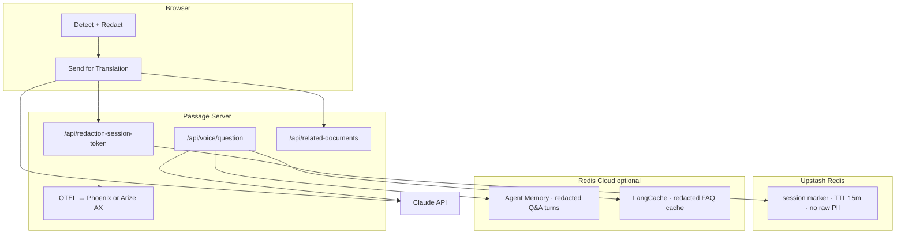

# Passage

**UC Berkeley AI Hackathon 2026 — World Track**

Paste an immigration letter, get it translated and explained in your language, ask follow-up questions by voice — while names, A-numbers, SSNs, dates of birth, passport numbers, and addresses are stripped **before anything reaches Claude**. Translation and read-back stay **tokenized** end-to-end; raw values never leave your browser.

The differentiator isn't "we use Claude to translate." It's that **redaction is a hard architectural boundary** — with validation that fails closed, error monitoring that catches real failures, and measurable detection accuracy. Privacy you can verify in devtools, not just in a policy.

---

## First-time setup

1. **Install dependencies** (once):

```bash
npm run install:all
```

2. **Copy env files** and fill in keys:

```bash
cp server/.env.example server/.env
cp client/.env.local.example client/.env.local   # optional — browser Sentry
```

3. **Required in `server/.env`:**

| Variable | Purpose |
|---|---|
| `ANTHROPIC_API_KEY` | Claude translation + voice Q&A |
| `UPSTASH_REDIS_REST_URL` | Upstash session registration (PII-free marker) |
| `UPSTASH_REDIS_REST_TOKEN` | Upstash REST credentials |
| `SENTRY_DSN` | Server error monitoring |
| `DEEPGRAM_API_KEY` | Voice transcription + TTS |

For **Arize AX Cloud** traces with `npm run launch -- --cloud`, also set `ARIZE_SPACE_ID` and `ARIZE_API_KEY` ([app.arize.com](https://app.arize.com) → Settings).

**Optional Redis Cloud** (voice memory + FAQ cache — redacted text only):

| Variable | Purpose |
|---|---|
| `AGENT_MEMORY_URL` + `AGENT_MEMORY_STORE_ID` + `AGENT_MEMORY_API_KEY` | Multi-turn voice Q&A |
| `LANGCACHE_URL` + `LANGCACHE_CACHE_ID` + `LANGCACHE_API_KEY` | Semantic cache for repeated voice questions |

4. **macOS only — allow double-click launch** (once):

```bash
./scripts/fix-launch-app.sh
```

If macOS still warns, right-click **Launch Passage.app** → **Open** → **Open** once.

---

## Run Passage

From the repo root:

```bash
./scripts/fix-launch-app.sh          # macOS — safe to re-run
npm run launch -- --cloud            # Arize AX Cloud traces
# npm run launch -- --local          # Local Phoenix (Docker) instead
```

Browser opens at **http://localhost:5173**. Pick your **translation language** on the landing screen first — the whole UI (nav, redaction review, tabs, voice controls, warnings) follows that choice. **Close that tab** when you are done — the launcher stops server and client automatically.

Logs if something fails: `.passage-launch.log`

**Port conflict?** If voice or API calls fail, kill any stale server:

```bash
lsof -ti:3001 | xargs kill
npm run launch -- --cloud
```

---

## Configure secrets (reference)

The server refuses to start without working Redis and Claude credentials. See [First-time setup](#first-time-setup) for the required variables.

### Observability — pick one at launch

| Mode | Set in `.env` | Where to get keys |
|---|---|---|
| **Local Phoenix** (default) | `OBSERVABILITY_TARGET=phoenix` | No keys needed — Docker only |
| **Arize AX Cloud** | `OBSERVABILITY_TARGET=ax` | [app.arize.com](https://app.arize.com) → **Settings** → **Space ID** + **API Key** |

```bash
# Local Phoenix
OBSERVABILITY_TARGET=phoenix
PHOENIX_COLLECTOR_ENDPOINT=http://localhost:6006
PHOENIX_PROJECT_NAME=immigration-redaction-demo

# Arize AX Cloud
OBSERVABILITY_TARGET=ax
ARIZE_SPACE_ID=your-space-id
ARIZE_API_KEY=your-api-key
ARIZE_PROJECT_NAME=immigration-redaction-demo
```

Both modes use the same OpenTelemetry + OpenInference stack — Claude traces and `redaction-check` recall spans work identically; only the export destination changes.

**Launcher vs `.env`:** `Launch Passage.app` / `launch.mjs` asks which backend to use (macOS dialog) or accepts `--local` / `--cloud`. That choice is passed to the server for that session and **overrides** `OBSERVABILITY_TARGET` in `.env`. For `npm run dev` without the launcher, `.env` controls the target.

### Redis Agent (optional — voice memory + FAQ cache)

Create both services at [cloud.redis.io](https://cloud.redis.io) when you want multi-turn voice or cache hits. Only redacted/tokenized text is stored.

### Client (`client/.env.local`)

| Variable | Purpose |
|---|---|
| `VITE_SENTRY_CLIENT_DSN` | Public browser Sentry DSN (optional) |

---

## Architecture



**Redis roles:**

1. **Upstash** — ephemeral session marker on translate (scoped creds; no raw PII stored)
2. **Agent Memory** — optional voice conversation history (tokenized turns only)
3. **LangCache** — optional semantic cache for paraphrased voice questions on the same redacted doc

---

## What Passage does

**Input:** Paste text, upload a **`.txt`** file (stays in-browser), or upload **`.pdf` / image** (server-side text extraction with an explicit privacy acknowledgment). Synthetic demo documents are available for testing.

**Output:** Plain-language translation + explanation in 10 languages (Spanish, French, Chinese, Vietnamese, Korean, Portuguese, Arabic, Hindi, Tagalog, Ukrainian). Voice follow-up questions; optional listen-back via TTS — all tokenized. **Related documents** tab lists commonly associated immigration document types for the detected process (Claude, redacted input only, in your chosen language).

**UI language:** Choose translation language on the **landing screen** before pasting. Site chrome, redaction review, tab labels, voice buttons, and TTS fallback warnings all follow that choice (11 locale packs under `client/src/i18n/`).

**Scope line:** Explains what a section is *asking for*. Does **not** tell anyone what to write in response.

---

## Privacy architecture

| Layer | What it does |
|---|---|
| **In-browser detection** | Hand-written regex + `Xenova/bert-base-NER` via Transformers.js — zero network calls after first model load |
| **Explicit send gate** | Nothing hits the network until **Send for translation** |
| **Token format** | `PII:TYPE:n` — placeholders only in Claude payloads |
| **No raw PII in Redis** | Upstash stores a session marker only; Agent Memory / LangCache store redacted text only |
| **Tokenized display** | Translation and voice answers show tokens, not reinserted raw values |
| **Pre-send leakage scan** | Blocks translate if raw PII survived redaction — Sentry alert |
| **Post-Claude validation** | Token check + raw-leak scan fails closed; no partial render |
| **Explanation-only TTS** | Deepgram speaks tokenized explanation text only |
| **Voice question redaction** | STT transcript redacted in browser before Claude |
| **Sentry scrubbing** | A-numbers, SSNs, DOB, passport, and address patterns scrubbed from events |

---

## Features built

### Detection & redaction
- 7 hand-labeled synthetic docs + 2 planted demo docs (Sentry validation failure, pre-send leakage block)
- Privacy tab: per-type counts, span confidence, amber token highlights, expandable Claude payload
- Per-doc recall score → observability backend

### Translation
- Claude Sonnet 4.6 — preserve tokens, explain sections, no legal advice
- Side-by-side redacted source + tokenized translation (no reinsertion)
- Manual **Listen** control on explanation TTS; localized native-voice vs English-fallback warning per language
- Fail-closed blocked state

### Related documents
- After translation, **prefetches** associated document types in the background (no wait for TTS)
- Claude identifies the immigration process + 5–8 commonly linked document types from **redacted text only**
- Responses localized via `target_language` (matches UI / translation picker)

### Voice
- Deepgram Nova-3 STT in the **document target language** (client token or server-proxy — key never in browser)
- Client-side **voice question redaction** before Claude (`prepareVoiceQuestion`)
- Voice answers validated fail-closed; display and TTS stay tokenized
- Multi-turn Q&A via **Redis Agent Memory** when configured
- **LangCache** instant answers for repeated FAQ on same doc
- Explanation-only TTS read-back on Translation and Voice tabs (manual play; optional **auto-play answer** checkbox on Voice tab)
- Mic disclaimer: *"Please type any ID numbers — don't say them out loud"* (localized)

#### Voice language support (STT vs TTS)

| | Supported |
|---|---|
| **STT (speech input)** | All 10 translation languages — mic uses the language you selected for translation (e.g. Chinese → `zh-CN`) |
| **TTS (read-back)** | **Native Aura-2 voice:** Spanish, French, Portuguese (plus de/it/ja/nl voice IDs when those languages are added to the picker) |
| **TTS fallback** | **English voice reads target-language text:** Chinese, Vietnamese, Korean, Arabic, Hindi, Tagalog, Ukrainian |

Deepgram Nova-3 transcribes all offered languages. Aura-2 TTS does not yet ship native voices for every language we translate into — for the fallback languages above, listen-back still works but uses an English voice model on tokenized explanation text (no raw PII). The fallback notice is **translated in the UI** (e.g. Chinese users see the warning in Chinese). Translation and voice **answers** are still in the target language; only the TTS accent is English until Deepgram adds those voices.

### Observability (Phoenix + Arize AX)
- Dual-target export — choose at launch
- Auto-instrumented Claude traces
- Custom `redaction-check` spans (recall, doc ID, run ID — metrics only)
- Batch + live browser scoring

### Error monitoring (Sentry)
- Validation mismatches, leakage blocks, Claude/Deepgram/voice failures
- Planted demo doc for live dashboard beat

---

## Verify it works

Keep Passage running (via launcher or separate `npm run dev` in `server/` and `client/`). For Phoenix mode, use the launcher or run `docker compose -f docker-compose.phoenix.yml up -d` first.

`test:phase5` and `test:phase6` call live HTTP endpoints — the server must already be listening on port **3001**.

```bash
cd server
npm run test:phases      # redaction, Redis, Claude, validation + Sentry
npm run test:phase5      # observability + recall scoring
npm run test:phase6      # Deepgram voice + TTS safety
npm run test:explanation-text

cd ../client
npm run verify:all                    # validation, regex, redact, voice-redaction, explanation-tts
npm run verify:demo-network           # Playwright — token-only API payloads (needs dev server)
npm run verify:detection              # Playwright — ?detection-test harness
npm run verify:tokenized-ui           # Playwright — no reinsertion in UI
npm run verify:sentry-browser         # Playwright — fail-closed validation beat
node scripts/verify-ui-locale-default.mjs   # i18n: landing picker + locale follows langCode

npm run score:redaction -- run-before-fix
npm run score:redaction -- run-after-fix   # from server/ — compare trend in observability UI
```

Filter observability UI by span name **`redaction-check`** or attribute **`redaction.run_id`**.

Failures logged in [`08-error-log.md`](08-error-log.md).

See [`PROJECT_ARCHITECTURE.md`](PROJECT_ARCHITECTURE.md) for the full file reference, data-flow diagrams, and technical assessment.

---

## Vanisha merge note

Verification tooling and detection audit cases from the teammate fork are integrated into this repo. The separate `Vanisha project/` copy was removed after porting.

---

## Demo script

See [`09-demo-script.md`](09-demo-script.md) for the timed 5-minute rehearsal (two distinct failure beats: detection gap vs validation mismatch).

---

## Project structure

```
launch.mjs / Launch Passage.app     — one-click launcher with observability picker + auto-shutdown
scripts/fix-launch-app.sh           — macOS Gatekeeper fix (sign + remove quarantine)
/client
  src/i18n/                         — UI strings (11 locales), workflow + voice/TTS packs
  src/ui/                           — landing scroll, language picker, redaction, results tabs
  src/hooks/usePassageFlow.ts       — phase state machine + related-docs prefetch
  src/styles/passage-v2.css         — design system from passage V2 Draft.html
/server
  src/lib/related-documents.ts      — Claude → process + associated doc types (localized)
  src/lib/observability/            — Phoenix + Arize AX dual export
  src/lib/agent-memory.ts           — Redis Agent Memory REST client
  src/lib/lang-cache.ts             — Redis LangCache REST client
docker-compose.phoenix.yml          — local Phoenix container
PROJECT_ARCHITECTURE.md             — full file reference + technical assessment
```

---

## API surface

```
GET  /api/health                    — startup probe (used by launcher)
POST /api/redaction-session-token   scoped Upstash credentials (no PII)
POST /api/translate                 redacted text → translated tokens
POST /api/score-redaction           recall metrics → observability span
POST /api/extract-document          PDF/image → text (server-side; user ack in UI)
POST /api/related-documents         redacted text → process + associated doc types
POST /api/deepgram-token            short-lived client token or server-proxy
POST /api/voice/question            transcript + redacted context → answer + TTS text
POST /api/voice/speak               PII-free text → MP3
POST /api/voice/transcribe          raw audio → transcript
```

---

## Not legal advice

Passage explains immigration paperwork in plain language. It does not provide legal advice, draft responses, or tell anyone how to answer a form.
