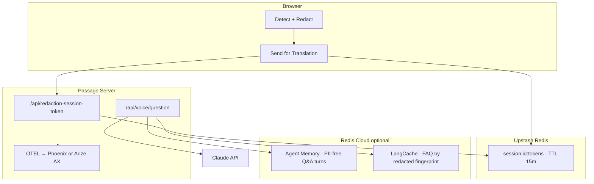

# Passage

**UC Berkeley AI Hackathon 2026 — World Track**

Paste an immigration letter, get it translated and explained in your language, ask follow-up questions by voice — while names, A-numbers, SSNs, dates of birth, passport numbers, and addresses are stripped **before anything reaches Claude**, then swapped back in only on your own screen at the end.

The differentiator isn't "we use Claude to translate." It's that **redaction is a hard architectural boundary** — with validation that fails closed, error monitoring that catches real failures, and measurable detection accuracy. Privacy you can verify in devtools, not just in a policy.

---

## Quick start (no terminal required on macOS)

**Double-click `Launch Passage.app`** in the repo root. A dialog asks:

- **Local Phoenix** — starts Docker Phoenix, exports traces to `http://localhost:6006`
- **Arize AX Cloud** — sends traces to your Arize AX dashboard (requires keys in `server/.env`)

The app installs dependencies if needed, starts server + client, and opens **http://localhost:5173**.

Logs: `.passage-launch.log` in the repo root.

**From terminal (any OS):**

```bash
npm run install:all    # once
node launch.mjs        # same dialog on macOS; defaults to Phoenix elsewhere
# or: node launch.mjs --local   /   node launch.mjs --cloud
```

---

## Configure secrets

```bash
cp server/.env.example server/.env
cp client/.env.local.example client/.env.local   # optional — browser Sentry
```

### Required (`server/.env`)

| Variable | Purpose |
|---|---|
| `ANTHROPIC_API_KEY` | Claude translation + voice Q&A |
| `UPSTASH_REDIS_REST_URL` | Ephemeral token-map storage (browser writes directly) |
| `UPSTASH_REDIS_REST_TOKEN` | Scoped credentials for Redis REST |
| `SENTRY_DSN` | Server error monitoring |
| `DEEPGRAM_API_KEY` | Voice transcription + TTS |

### Observability — pick one at launch

| Mode | Set in `.env` | Where to get keys |
|---|---|---|
| **Local Phoenix** (default) | `OBSERVABILITY_TARGET=phoenix` | No keys needed — Docker only |
| **Arize AX Cloud** | `OBSERVABILITY_TARGET=ax` | [app.arize.com](https://app.arize.com) → **Settings** → **Space ID** + **API Key** |

```bash
# Local Phoenix
OBSERVABILITY_TARGET=phoenix
PHOENIX_COLLECTOR_ENDPOINT=http://localhost:6006
PHOENIX_PROJECT_NAME=immigration-redaction-demo

# Arize AX Cloud
OBSERVABILITY_TARGET=ax
ARIZE_SPACE_ID=your-space-id
ARIZE_API_KEY=your-api-key
ARIZE_PROJECT_NAME=immigration-redaction-demo
```

Both modes use the same OpenTelemetry + OpenInference stack — Claude traces and `redaction-check` recall spans work identically; only the export destination changes.

### Redis Agent (optional — voice memory + FAQ cache)

Create both services at [cloud.redis.io](https://cloud.redis.io) (free tier):

| Variable | Service | Purpose |
|---|---|---|
| `AGENT_MEMORY_URL` | Agent Memory → Configuration → Endpoint | Multi-turn voice Q&A history |
| `AGENT_MEMORY_STORE_ID` | Agent Memory → General settings | Store ID |
| `AGENT_MEMORY_API_KEY` | Agent Memory → API Keys | Bearer token (shown once at creation) |
| `LANGCACHE_URL` | LangCache → Configuration → Host | Semantic cache for repeated voice questions |
| `LANGCACHE_CACHE_ID` | LangCache → service name (e.g. `cache-XXXX`) | Cache ID |
| `LANGCACHE_API_KEY` | LangCache → API Keys | Bearer token |

If unset, voice still works — just without conversation memory or cache hits.

### Client (`client/.env.local`)

| Variable | Purpose |
|---|---|
| `VITE_SENTRY_CLIENT_DSN` | Public browser Sentry DSN (optional) |

---

## Architecture



**Three Redis roles, all separate:**

1. **Upstash** — ephemeral token maps (privacy-critical; browser writes directly)
2. **Agent Memory** — voice conversation history (PII-free text only)
3. **LangCache** — semantic cache for paraphrased voice questions on the same redacted doc

---

## What Passage does

**Input:** Paste text from an RFE, biometrics notice, EAD receipt, NTA, or similar. Text only — no file upload.

**Output:** Plain-language translation + explanation in 10 languages (Spanish, French, Chinese, Vietnamese, Korean, Portuguese, Arabic, Hindi, Tagalog, Ukrainian). Voice follow-up questions with optional multi-turn memory, read back via TTS.

**Scope line:** Explains what a section is *asking for*. Does **not** tell anyone what to write in response.

---

## Privacy architecture

| Layer | What it does |
|---|---|
| **In-browser detection** | Hand-written regex + `Xenova/bert-base-NER` via Transformers.js — zero network calls after first model load |
| **Explicit send gate** | Nothing hits the network until **Send for translation** — not even Redis |
| **Token format** | `PII:TYPE:n` — placeholders only in Claude payloads |
| **Backend never sees PII** | Server mints scoped Upstash credentials; browser writes token map directly to Redis REST |
| **Ephemeral sessions** | Token maps TTL **15 minutes** |
| **Pre-send leakage scan** | Blocks translate if raw PII survived redaction — Sentry alert |
| **Post-Claude validation** | Token check fails closed; no partial render |
| **Local reinsertion** | Real values only in final browser DOM |
| **Voice + Redis Agent safety** | Agent Memory and LangCache store **PII-free text only**; server guards block SSN/A-number patterns before store or TTS |
| **Sentry scrubbing** | A-numbers and SSNs stripped from events on client and server |

---

## Features built

### Detection & redaction
- 9 hand-labeled synthetic docs + 2 planted demo docs (Sentry validation failure, pre-send leakage block)
- Privacy tab: per-type counts, span confidence, amber token highlights, expandable Claude payload
- Per-doc recall score → observability backend

### Translation
- Claude Sonnet 4.6 — preserve tokens, explain sections, no legal advice
- Side-by-side original + translated with local reinsertion
- Fail-closed blocked state

### Voice
- Deepgram Nova-3 STT (client token or server-proxy — key never in browser)
- Multi-turn Q&A via **Redis Agent Memory** when configured
- **LangCache** instant answers for repeated FAQ on same doc
- Deepgram TTS on PII-free text with visible preview
- Mic disclaimer: *"Please type any ID numbers — don't say them out loud"*

### Observability (Phoenix + Arize AX)
- Dual-target export — choose at launch
- Auto-instrumented Claude traces
- Custom `redaction-check` spans (recall, doc ID, run ID — metrics only)
- Batch + live browser scoring

### Error monitoring (Sentry)
- Validation mismatches, leakage blocks, Claude/Deepgram/voice failures
- Planted demo doc for live dashboard beat

---

## Verify it works

Server must be running. For Phoenix mode, Docker must be up (launcher starts it automatically).

```bash
cd server
npm run test:phases      # redaction, Redis, Claude, validation + Sentry
npm run test:phase5      # observability + recall scoring
npm run test:phase6      # Deepgram voice + TTS safety

npm run score:redaction              # batch recall
npm run score:redaction -- run-after-fix   # second run — compare trend
```

Filter observability UI by span name **`redaction-check`** or attribute **`redaction.run_id`**.

Failures logged in [`08-error-log.md`](08-error-log.md).

---

## Project structure

```
launch.mjs / Launch Passage.app     — one-click launcher with observability picker
/client                             — React + Vite (no secrets)
/server
  src/lib/observability/             — Phoenix + Arize AX dual export
  src/lib/agent-memory.ts            — Redis Agent Memory REST client
  src/lib/lang-cache.ts              — Redis LangCache REST client
  src/hooks/usePassageFlow.ts        — core flow (in client)
docker-compose.phoenix.yml            — local Phoenix container
```

---

## API surface

```
POST /api/redaction-session-token   scoped Upstash credentials (no PII)
POST /api/translate                 redacted text → translated tokens
POST /api/score-redaction           recall metrics → observability span
POST /api/deepgram-token            short-lived client token or server-proxy
POST /api/voice/question            transcript + redacted context → answer + TTS text
POST /api/voice/speak               PII-free text → MP3
POST /api/voice/transcribe          raw audio → transcript
```

---

## Not legal advice

Passage explains immigration paperwork in plain language. It does not provide legal advice, draft responses, or tell anyone how to answer a form.
